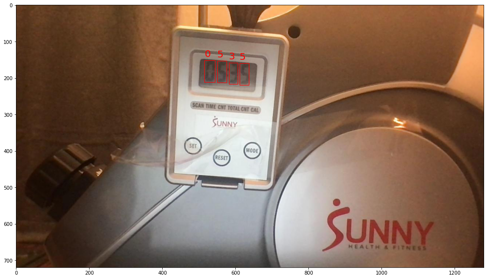
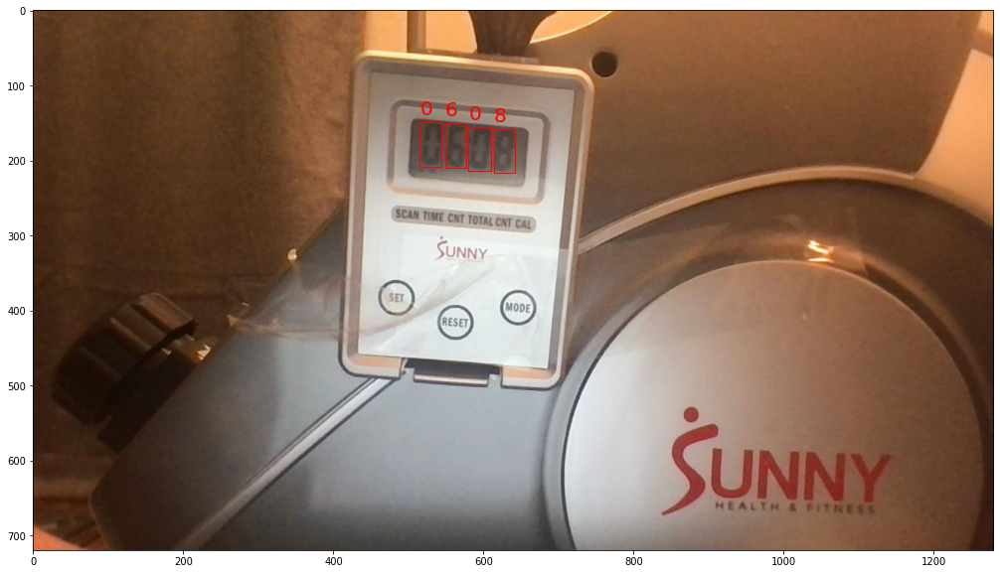

# Model-asisted Labeling with YOLOv5
> custom image set annotation with a model's help


## Background

My exercise equipment, despite even being electronic, doesn’t connect to a network.

But if I instead point my webcam at the equipment’s LCD output, I can make a machine learn to identify and interpret useful information. Perfect! I’ll just utilize object detection to determine the location and identity of the machine’s analog readout. 

First question, just a tiny one, how do you do that?  

After wading through several guides, I found [Roboflow's YOLOv5 tutorial]( https://models.roboflow.com/object-detection/yolov5). They helped provide a hands-on and accessible experience in machine learning.

Unfortunately, I didn't have much luck with existing models being able to readily parse digits. Instead, I decided to start building my own dataset.

I shouldn't have been caught off-guard by the tedium of manually annotating images. As my mind starts to drift, I wonder if I’m a reCAPTCHA interface that’s gained sentience, and I break through. If I label enough digits, I can train a YOLO model to tell me what it sees. I can then take that information and pre-label my images with those predictions. 

The pieces come together.  I can focus on writing code while I use Roboflow to sort, generate, and deliver my images. I sleuth through [Ultralytic's](https://github.com/ultralytics/yolov5) original project and build wrappers around the essential functions in `detect.py` and `train.py`.

This repository contains the tools that let me "pre-label" my images before sending them off for human inspection and correction.

I need two inputs:
* Either:
  + a set of YOLOv5 weights 
  + or a repository of ".jpg" images and ".txt" labels.
* And:
  + a folder with unlabeled images



## Getting Started



```
# clone this repository
!git clone https://github.com/PhilBrockman/ModelAssistedLabel.git
%cd "ModelAssistedLabel"
```

### Expected Inputs:

-  **labeled images**
    + All of the images and labels must be in a common folder (subfolders allowed).
    + Labels must be in [YOLOv5 format](https://github.com/AlexeyAB/Yolo_mark/issues/60#issuecomment-401854885).



```
# these images have already been labeled
labeled_images   = "Image Repo/labeled/Final Roboflow Export (841)"
```

  - **unlabeled images**

```
# these images need to be labeled
unlabeled_images = "Image Repo/unlabeled/21-3-22 rowing (200) 1:53-7:00"
```

### Expected Output:

* **Folder** that contains: 
    - `images/`
      + a copy of every image in **Unlabeled Data**
    - `labels/`
      + result of running object detection on each image
    - a results folder produced by Ultralytic's `train.py` on the **Labeled Data** (if not using pre-trained weights)
    - `class labels.txt` to preserve the identity of the classes


```
from ModelAssistedLabel.config import Defaults
import os

project_name = "seven segment digits - "
export_folder = Defaults._itername(project_name)

print(export_folder)
```

    seven segment digits - 1


```
# make the export folder
os.mkdir(export_folder)

# make the images and labels subfolders
for resource_folder in ["images", "labels"]:
  os.mkdir(os.path.join(export_folder, resource_folder))
```

## Configure defaults

Several values are stored by the `Defaults` class. Any value can be overridden (and new values can be added. Make sure to `save()` any changes!

```
d = Defaults()
print(" -- Defined Keys: --")
print("\n".join([x for x in d.__dict__.keys()]))
```

     -- Defined Keys: --
    config_file
    root
    split_ratio
    data_yaml
    resource_map
    trainer_template


Speciy the absolute path of the root directory.

```
!pwd
```

    /content/drive/My Drive/Coding/ModelAssistedLabel


```
d.root = "/content/ModelAssistedLabel/"
```

Save any changes and enter root directory

```
d.save()
d.to_root()
```

    moving to /content/drive/MyDrive/Coding/ModelAssistedLabel/


I borrow the instructions to set up the Ultralytics repo from [the Roboflow tutorial]( https://models.roboflow.com/object-detection/yolov5). (If I'd be allowed one undo on this project, I wish I would have intially forked this project from that tutorial.)

```
# clone YOLOv5 repository
!git clone https://github.com/ultralytics/yolov5  # clone repo

%cd yolov5
# install dependencies as necessary
!pip install -qr requirements.txt  # install dependencies (ignore errors)
import torch

from IPython.display import Image, clear_output  # to display images
from utils.google_utils import gdrive_download  # to download models/datasets
%cd ..
```

    /content/drive/My Drive/Coding/ModelAssistedLabel/yolov5
         |████████████████████████████████| 645kB 15.9MB/s 
    [?25h/content/drive/My Drive/Coding/ModelAssistedLabel


Make sure GPU is enabled.

```
if torch.cuda.is_available():
  print('Setup complete. Using torch %s %s' % (torch.__version__, torch.cuda.get_device_properties(0) ))
  d.to_root() #step up a level
else:
   raise Exception("enable GPU")
```

    Setup complete. Using torch 1.8.0+cu101 _CudaDeviceProperties(name='Tesla P100-PCIE-16GB', major=6, minor=0, total_memory=16280MB, multi_processor_count=56)
    moving to /content/drive/MyDrive/Coding/ModelAssistedLabel/


## Processing input

```
from ModelAssistedLabel.fileManagement import Generation
datadump = "path/to/anywhere"

g = Generation(repo=labeled_images, 
               out_dir=datadump,
               verbose=True)

g.set_split()
g.get_split()
zipped = g.write_split_to_disk(descriptor="<01_split_all>")
```

Next, the images need to be written in a way so that the Ultralytics repository can understand their content. The `Autoweights` class both organizes data and create weights. Running an "initialize" command makes changes to the disk.

```
from ModelAssistedLabel.train import AutoWeights
#configure a basic AutoWeights class instance
aw = AutoWeights(name=export_folder, out_dir=datadump)

# create train/valid/test split from a bag of labeled images (recusively seek out images/labels)
aw.initialize_images_from_zip(zipped)
```

Peep on the sizes of the train/valid/test groups.

```
aw.traverse_resources()
```

    
    dirs ['./train', './valid', './test']
    yaml ipynb_tests/indexdump/autoweights/Final Roboflow Export (841)<index auto weights> 21-03-26 16-39-59/data.yaml
    subdir train
    	outdir ipynb_tests/indexdump/autoweights/Final Roboflow Export (841)<index auto weights> 21-03-26 16-39-59
    subdir valid
    	outdir ipynb_tests/indexdump/autoweights/Final Roboflow Export (841)<index auto weights> 21-03-26 16-39-59
    subdir test
    	outdir ipynb_tests/indexdump/autoweights/Final Roboflow Export (841)<index auto weights> 21-03-26 16-39-59
    os.listdir ['train', 'valid', 'test', 'data.yaml']
    mv 'unzipped/ipynb_tests/indexdump/autoweights/Final Roboflow Export (841)<index auto weights> 21-03-26 16-39-59/train' .
    mv 'unzipped/ipynb_tests/indexdump/autoweights/Final Roboflow Export (841)<index auto weights> 21-03-26 16-39-59/valid' .
    mv 'unzipped/ipynb_tests/indexdump/autoweights/Final Roboflow Export (841)<index auto weights> 21-03-26 16-39-59/test' .
    mv 'unzipped/ipynb_tests/indexdump/autoweights/Final Roboflow Export (841)<index auto weights> 21-03-26 16-39-59/data.yaml' .
    train/images
    	 > 589 files
    train/labels
    	 > 589 files
    valid/images
    	 > 169 files
    valid/labels
    	 > 169 files
    test/images
    	 > 83 files
    test/labels
    	 > 83 files
    File:  True


## Generate Weights

With the images written to disk, we can run the Ultralytics training algorithm. I loved watching the progress fly by in real time on the original `train.py`. Fortunately, the Ultralytics folk write the results file to disk so the model's training data is still accessible!

```
%%time
aw.generate_weights(2000)
```

    CPU times: user 43.5 s, sys: 4.84 s, total: 48.3 s
    Wall time: 3h 46min 43s


    'yolov5/runs/train/<index auto weights>/'


The results folder is stored as an attribute as well, and it has a lot of data stored therein.

```
import os
aw.last_results_path, len(os.listdir(aw.last_results_path))
```


    ('yolov5/runs/train/<index auto weights>/', 22)


However, the weights are stored in a subfolder called (aptly) "weights".

```
os.listdir(aw.last_results_path + "/weights")
```


    ['last.pt', 'best.pt']


View the last couple lines 

```
with open(aw.last_results_path + "results.txt") as results_file:
  results = results_file.readlines()
print("Epoch   gpu_mem       box       obj       cls     total    labels  img_size")
results[-5:]
```

    Epoch   gpu_mem       box       obj       cls     total    labels  img_size


    [' 1995/1999      1.8G    0.0231   0.01575  0.006738   0.04559       124       416    0.9932    0.9917    0.9938    0.8766   0.02019   0.01382  0.005234\n',
     ' 1996/1999      1.8G   0.02331   0.01637  0.006541   0.04622       158       416    0.9932    0.9917    0.9938    0.8763   0.02019   0.01386  0.005235\n',
     ' 1997/1999      1.8G     0.024   0.01509  0.007179   0.04626       158       416    0.9932    0.9917    0.9938    0.8764   0.02019   0.01383  0.005234\n',
     ' 1998/1999      1.8G   0.02421   0.01669  0.007122   0.04802        97       416    0.9932    0.9917    0.9938    0.8762   0.02019   0.01383  0.005234\n',
     ' 1999/1999      1.8G   0.02361   0.01668  0.007164   0.04745       199       416    0.9932    0.9917    0.9938    0.8763   0.02019   0.01386  0.005235\n']


## Labeling a new set of images

The names of my classes are digits. Under the hood, the YOLOv5 model is working of the index of the class, rather than the human-readable name. Consequently, the identities of each class index must be supplied.

```
class_idx = ['1', '2', '3', '4', '5', '6', '7', '8', '9', '0']
```

And the `Viewer` class doesn't care how recently your weights were generated so you can plug in existing weights.

```
from ModelAssistedLabel.detect import Viewer

# access the folder of results from the AutoWeights instance
results_folder = aw.last_results_path

# I'm choosing to use the best weight.
weight_path = results_folder + "/weights/best.pt"

# Viewer needs a set of weights and an array of labels for the detected object types
v = Viewer(weight_path, class_idx)
```

    Fusing layers... 


Selects all images in the unlabeled folder and let's us look through the computer's eyes at the images.

```
%matplotlib inline 
import random, glob

images = glob.glob(f"./{unlabeled_images}/*.jpg")

for image in random.sample(images,5):
  v.plot_for(image)
```

    image 1/1 /content/drive/MyDrive/Coding/ModelAssistedLabel/Image Repo/unlabeled/21-3-22 rowing (200) 1:53-7:00/144.jpg: >>> [{'predictions': ['2 0.465234 0.260417 0.0195312 0.0819444 0.678878', '4 0.439844 0.254167 0.0203125 0.0833333 0.867007', '9 0.414453 0.252778 0.0226563 0.0833333 0.873467', '4 0.488281 0.263889 0.0203125 0.0833333 0.885513']}]





    image 1/1 /content/drive/MyDrive/Coding/ModelAssistedLabel/Image Repo/unlabeled/21-3-22 rowing (200) 1:53-7:00/189.jpg: >>> [{'predictions': ['5 0.439453 0.251389 0.0210938 0.0833333 0.881868', '9 0.414453 0.249306 0.0226563 0.0847222 0.882727', '4 0.489844 0.258333 0.021875 0.0833333 0.904524']}]


    image 1/1 /content/drive/MyDrive/Coding/ModelAssistedLabel/Image Repo/unlabeled/21-3-22 rowing (200) 1:53-7:00/165.jpg: >>> [{'predictions': ['7 0.490625 0.260417 0.021875 0.0819444 0.686349', '9 0.464844 0.257639 0.0234375 0.0819444 0.766056', '9 0.414453 0.249306 0.0226563 0.0847222 0.892554', '5 0.439844 0.252083 0.021875 0.0847222 0.896628']}]





```
results = []
for image in images:
  results.append(v.predict_for(image))
```

    image 1/1 /content/drive/MyDrive/Coding/ModelAssistedLabel/Image Repo/unlabeled/21-3-22 rowing (200) 1:53-7:00/7.jpg: image 1/1 /content/drive/MyDrive/Coding/ModelAssistedLabel/Image Repo/unlabeled/21-3-22 rowing (200) 1:53-7:00/13.jpg: >>> [{'predictions': ['0 0.0363281 0.28125 0.0664062 0.556944 0.414134']}]
    image 1/1 /content/drive/MyDrive/Coding/ModelAssistedLabel/Image Repo/unlabeled/21-3-22 rowing (200) 1:53-7:00/11.jpg: image 1/1 /content/drive/My Drive/Coding/ModelAssistedLabel/Image Repo/unlabeled/21-3-22 rowing (200) 1:53-7:00/19.jpg: image 1/1 /content/drive/My Drive/Coding/ModelAssistedLabel/Image Repo/unlabeled/21-3-22 rowing (200) 1:53-7:00/6.jpg: image 1/1 /content/drive/My Drive/Coding/ModelAssistedLabel/Image Repo/unlabeled/21-3-22 rowing (200) 1:53-7:00/25.jpg: image 1/1 /content/drive/My Drive/Coding/ModelAssistedLabel/Image Repo/unlabeled/21-3-22 rowing (200) 1:53-7:00/9.jpg: >>> [{'predictions': ['0 0.0339844 0.274306 0.0664062 0.509722 0.477815']}]
    image 1/1 /content/drive/My Drive/Coding/ModelAssistedLabel/Image Repo/unlabeled/21-3-22 rowing (200) 1:53-7:00/16.jpg: image 1/1 /content/drive/My Drive/Coding/ModelAssistedLabel/Image Repo/unlabeled/21-3-22 rowing (200) 1:53-7:00/5.jpg: image 1/1 /content/drive/My Drive/Coding/ModelAssistedLabel/Image Repo/unlabeled/21-3-22 rowing (200) 1:53-7:00/23.jpg: image 1/1 /content/drive/My Drive/Coding/ModelAssistedLabel/Image Repo/unlabeled/21-3-22 rowing (200) 1:53-7:00/8.jpg: image 1/1 /content/drive/My Drive/Coding/ModelAssistedLabel/Image Repo/unlabeled/21-3-22 rowing (200) 1:53-7:00/17.jpg: image 1/1 /content/drive/My Drive/Coding/ModelAssistedLabel/Image Repo/unlabeled/21-3-22 rowing (200) 1:53-7:00/22.jpg: image 1/1 /content/drive/My Drive/Coding/ModelAssistedLabel/Image Repo/unlabeled/21-3-22 rowing (200) 1:53-7:00/1.jpg: image 1/1 /content/drive/MyDrive/Coding/ModelAssistedLabel/Image Repo/unlabeled/21-3-22 rowing (200) 1:53-7:00/24.jpg: image 1/1 /content/drive/MyDrive/Coding/ModelAssistedLabel/Image Repo/unlabeled/21-3-22 rowing (200) 1:53-7:00/15.jpg: image 1/1 /content/drive/MyDrive/Coding/ModelAssistedLabel/Image Repo/unlabeled/21-3-22 rowing (200) 1:53-7:00/0.jpg: >>> [{'predictions': ['0 0.0378906 0.274306 0.0695312 0.548611 0.597729']}]
    image 1/1 /content/drive/MyDrive/Coding/ModelAssistedLabel/Image Repo/unlabeled/21-3-22 rowing (200) 1:53-7:00/14.jpg: image 1/1 /content/drive/MyDrive/Coding/ModelAssistedLabel/Image Repo/unlabeled/21-3-22 rowing (200) 1:53-7:00/2.jpg: image 1/1 /content/drive/MyDrive/Coding/ModelAssistedLabel/Image Repo/unlabeled/21-3-22 rowing (200) 1:53-7:00/20.jpg: image 1/1 /content/drive/MyDrive/Coding/ModelAssistedLabel/Image Repo/unlabeled/21-3-22 rowing (200) 1:53-7:00/4.jpg: image 1/1 /content/drive/MyDrive/Coding/ModelAssistedLabel/Image Repo/unlabeled/21-3-22 rowing (200) 1:53-7:00/3.jpg: image 1/1 /content/drive/MyDrive/Coding/ModelAssistedLabel/Image Repo/unlabeled/21-3-22 rowing (200) 1:53-7:00/18.jpg: image 1/1 /content/drive/MyDrive/Coding/ModelAssistedLabel/Image Repo/unlabeled/21-3-22 rowing (200) 1:53-7:00/12.jpg: >>> [{'predictions': ['0 0.0367187 0.286111 0.06875 0.555556 0.420037']}]
    image 1/1 /content/drive/MyDrive/Coding/ModelAssistedLabel/Image Repo/unlabeled/21-3-22 rowing (200) 1:53-7:00/21.jpg: image 1/1 /content/drive/MyDrive/Coding/ModelAssistedLabel/Image Repo/unlabeled/21-3-22 rowing (200) 1:53-7:00/10.jpg: image 1/1 /content/drive/MyDrive/Coding/ModelAssistedLabel/Image Repo/unlabeled/21-3-22 rowing (200) 1:53-7:00/43.jpg: image 1/1 /content/drive/MyDrive/Coding/ModelAssistedLabel/Image Repo/unlabeled/21-3-22 rowing (200) 1:53-7:00/57.jpg: image 1/1 /content/drive/MyDrive/Coding/ModelAssistedLabel/Image Repo/unlabeled/21-3-22 rowing (200) 1:53-7:00/33.jpg: image 1/1 /content/drive/MyDrive/Coding/ModelAssistedLabel/Image Repo/unlabeled/21-3-22 rowing (200) 1:53-7:00/67.jpg: >>> [{'predictions': ['2 0.465234 0.261111 0.0195312 0.0805556 0.585224', '2 0.440625 0.255556 0.0203125 0.0833333 0.85652', '9 0.414062 0.252778 0.021875 0.0833333 0.878323', '5 0.488281 0.264583 0.0203125 0.0819444 0.898147']}]
    image 1/1 /content/drive/MyDrive/Coding/ModelAssistedLabel/Image Repo/unlabeled/21-3-22 rowing (200) 1:53-7:00/51.jpg: image 1/1 /content/drive/MyDrive/Coding/ModelAssistedLabel/Image Repo/unlabeled/21-3-22 rowing (200) 1:53-7:00/52.jpg: image 1/1 /content/drive/MyDrive/Coding/ModelAssistedLabel/Image Repo/unlabeled/21-3-22 rowing (200) 1:53-7:00/53.jpg: image 1/1 /content/drive/MyDrive/Coding/ModelAssistedLabel/Image Repo/unlabeled/21-3-22 rowing (200) 1:53-7:00/42.jpg: image 1/1 /content/drive/MyDrive/Coding/ModelAssistedLabel/Image Repo/unlabeled/21-3-22 rowing (200) 1:53-7:00/48.jpg: image 1/1 /content/drive/MyDrive/Coding/ModelAssistedLabel/Image Repo/unlabeled/21-3-22 rowing (200) 1:53-7:00/35.jpg: image 1/1 /content/drive/MyDrive/Coding/ModelAssistedLabel/Image Repo/unlabeled/21-3-22 rowing (200) 1:53-7:00/27.jpg: >>> [{'predictions': ['9 0.416406 0.246528 0.021875 0.0763889 0.597006']}]
    image 1/1 /content/drive/MyDrive/Coding/ModelAssistedLabel/Image Repo/unlabeled/21-3-22 rowing (200) 1:53-7:00/39.jpg: image 1/1 /content/drive/MyDrive/Coding/ModelAssistedLabel/Image Repo/unlabeled/21-3-22 rowing (200) 1:53-7:00/62.jpg: image 1/1 /content/drive/MyDrive/Coding/ModelAssistedLabel/Image Repo/unlabeled/21-3-22 rowing (200) 1:53-7:00/63.jpg: >>> [{'predictions': ['9 0.416016 0.250694 0.0210938 0.0819444 0.817183']}]
    image 1/1 /content/drive/MyDrive/Coding/ModelAssistedLabel/Image Repo/unlabeled/21-3-22 rowing (200) 1:53-7:00/45.jpg: image 1/1 /content/drive/MyDrive/Coding/ModelAssistedLabel/Image Repo/unlabeled/21-3-22 rowing (200) 1:53-7:00/65.jpg: >>> [{'predictions': ['2 0.442187 0.25625 0.0203125 0.0847222 0.751456', '2 0.465234 0.258333 0.0195312 0.0805556 0.846264', '9 0.415625 0.251389 0.021875 0.0833333 0.876376', '2 0.490625 0.261111 0.0203125 0.0833333 0.878784']}]
    image 1/1 /content/drive/MyDrive/Coding/ModelAssistedLabel/Image Repo/unlabeled/21-3-22 rowing (200) 1:53-7:00/66.jpg: >>> [{'predictions': ['2 0.466406 0.257639 0.0203125 0.0819444 0.731603', '2 0.442187 0.255556 0.0203125 0.0861111 0.785163', '4 0.489844 0.259028 0.0203125 0.0819444 0.869211', '9 0.415625 0.250694 0.021875 0.0819444 0.874603']}]
    image 1/1 /content/drive/MyDrive/Coding/ModelAssistedLabel/Image Repo/unlabeled/21-3-22 rowing (200) 1:53-7:00/56.jpg: image 1/1 /content/drive/MyDrive/Coding/ModelAssistedLabel/Image Repo/unlabeled/21-3-22 rowing (200) 1:53-7:00/49.jpg: image 1/1 /content/drive/MyDrive/Coding/ModelAssistedLabel/Image Repo/unlabeled/21-3-22 rowing (200) 1:53-7:00/60.jpg: image 1/1 /content/drive/MyDrive/Coding/ModelAssistedLabel/Image Repo/unlabeled/21-3-22 rowing (200) 1:53-7:00/31.jpg: image 1/1 /content/drive/MyDrive/Coding/ModelAssistedLabel/Image Repo/unlabeled/21-3-22 rowing (200) 1:53-7:00/58.jpg: image 1/1 /content/drive/MyDrive/Coding/ModelAssistedLabel/Image Repo/unlabeled/21-3-22 rowing (200) 1:53-7:00/29.jpg: image 1/1 /content/drive/MyDrive/Coding/ModelAssistedLabel/Image Repo/unlabeled/21-3-22 rowing (200) 1:53-7:00/59.jpg: image 1/1 /content/drive/MyDrive/Coding/ModelAssistedLabel/Image Repo/unlabeled/21-3-22 rowing (200) 1:53-7:00/40.jpg: image 1/1 /content/drive/MyDrive/Coding/ModelAssistedLabel/Image Repo/unlabeled/21-3-22 rowing (200) 1:53-7:00/44.jpg: image 1/1 /content/drive/MyDrive/Coding/ModelAssistedLabel/Image Repo/unlabeled/21-3-22 rowing (200) 1:53-7:00/26.jpg: image 1/1 /content/drive/MyDrive/Coding/ModelAssistedLabel/Image Repo/unlabeled/21-3-22 rowing (200) 1:53-7:00/54.jpg: image 1/1 /content/drive/MyDrive/Coding/ModelAssistedLabel/Image Repo/unlabeled/21-3-22 rowing (200) 1:53-7:00/47.jpg: image 1/1 /content/drive/MyDrive/Coding/ModelAssistedLabel/Image Repo/unlabeled/21-3-22 rowing (200) 1:53-7:00/41.jpg: image 1/1 /content/drive/MyDrive/Coding/ModelAssistedLabel/Image Repo/unlabeled/21-3-22 rowing (200) 1:53-7:00/36.jpg: image 1/1 /content/drive/MyDrive/Coding/ModelAssistedLabel/Image Repo/unlabeled/21-3-22 rowing (200) 1:53-7:00/38.jpg: image 1/1 /content/drive/MyDrive/Coding/ModelAssistedLabel/Image Repo/unlabeled/21-3-22 rowing (200) 1:53-7:00/30.jpg: image 1/1 /content/drive/MyDrive/Coding/ModelAssistedLabel/Image Repo/unlabeled/21-3-22 rowing (200) 1:53-7:00/55.jpg: image 1/1 /content/drive/MyDrive/Coding/ModelAssistedLabel/Image Repo/unlabeled/21-3-22 rowing (200) 1:53-7:00/28.jpg: image 1/1 /content/drive/MyDrive/Coding/ModelAssistedLabel/Image Repo/unlabeled/21-3-22 rowing (200) 1:53-7:00/37.jpg: image 1/1 /content/drive/MyDrive/Coding/ModelAssistedLabel/Image Repo/unlabeled/21-3-22 rowing (200) 1:53-7:00/61.jpg: image 1/1 /content/drive/MyDrive/Coding/ModelAssistedLabel/Image Repo/unlabeled/21-3-22 rowing (200) 1:53-7:00/32.jpg: image 1/1 /content/drive/MyDrive/Coding/ModelAssistedLabel/Image Repo/unlabeled/21-3-22 rowing (200) 1:53-7:00/46.jpg: image 1/1 /content/drive/MyDrive/Coding/ModelAssistedLabel/Image Repo/unlabeled/21-3-22 rowing (200) 1:53-7:00/50.jpg: image 1/1 /content/drive/MyDrive/Coding/ModelAssistedLabel/Image Repo/unlabeled/21-3-22 rowing (200) 1:53-7:00/64.jpg: >>> [{'predictions': ['2 0.442187 0.255556 0.0203125 0.0861111 0.752997', '2 0.466016 0.257639 0.0195312 0.0847222 0.828449', '9 0.416016 0.250694 0.0210938 0.0819444 0.87121']}]
    image 1/1 /content/drive/MyDrive/Coding/ModelAssistedLabel/Image Repo/unlabeled/21-3-22 rowing (200) 1:53-7:00/34.jpg: image 1/1 /content/drive/MyDrive/Coding/ModelAssistedLabel/Image Repo/unlabeled/21-3-22 rowing (200) 1:53-7:00/98.jpg: >>> [{'predictions': ['3 0.441797 0.252778 0.0210938 0.0805556 0.736039', '3 0.492578 0.256944 0.0195312 0.075 0.842366', '9 0.416016 0.25 0.0226563 0.0833333 0.870805', '1 0.466797 0.256944 0.0210938 0.0805556 0.888695']}]
    image 1/1 /content/drive/MyDrive/Coding/ModelAssistedLabel/Image Repo/unlabeled/21-3-22 rowing (200) 1:53-7:00/74.jpg: >>> [{'predictions': ['3 0.465234 0.258333 0.0210938 0.0805556 0.733264', '6 0.49375 0.260417 0.01875 0.0819444 0.795855', '2 0.441406 0.252778 0.0203125 0.0833333 0.804589', '9 0.415234 0.251389 0.0226563 0.0833333 0.879225']}]
    image 1/1 /content/drive/MyDrive/Coding/ModelAssistedLabel/Image Repo/unlabeled/21-3-22 rowing (200) 1:53-7:00/93.jpg: >>> [{'predictions': ['3 0.442969 0.255556 0.0234375 0.0805556 0.778528', '9 0.415625 0.251389 0.021875 0.0833333 0.878038', '5 0.489844 0.261806 0.0203125 0.0791667 0.87933']}]
    image 1/1 /content/drive/MyDrive/Coding/ModelAssistedLabel/Image Repo/unlabeled/21-3-22 rowing (200) 1:53-7:00/106.jpg: >>> [{'predictions': ['3 0.442187 0.253472 0.021875 0.0791667 0.751064', '9 0.415234 0.250694 0.0210938 0.0819444 0.856613', '5 0.489062 0.261806 0.0203125 0.0819444 0.880629']}]
    image 1/1 /content/drive/My Drive/Coding/ModelAssistedLabel/Image Repo/unlabeled/21-3-22 rowing (200) 1:53-7:00/90.jpg: >>> [{'predictions': ['0 0.473828 0.255556 0.0148437 0.0722222 0.517592', '3 0.443359 0.252778 0.0226563 0.0805556 0.749162', '9 0.416797 0.249306 0.0226563 0.0819444 0.875509', '1 0.491406 0.259028 0.021875 0.0819444 0.911799']}]
    image 1/1 /content/drive/My Drive/Coding/ModelAssistedLabel/Image Repo/unlabeled/21-3-22 rowing (200) 1:53-7:00/104.jpg: >>> [{'predictions': ['3 0.442187 0.250694 0.021875 0.0819444 0.688928', '9 0.416016 0.249306 0.0226563 0.0819444 0.868596', '2 0.491797 0.258333 0.0195312 0.0833333 0.878987', '2 0.466016 0.253472 0.0195312 0.0819444 0.899653']}]
    image 1/1 /content/drive/My Drive/Coding/ModelAssistedLabel/Image Repo/unlabeled/21-3-22 rowing (200) 1:53-7:00/73.jpg: >>> [{'predictions': ['5 0.490625 0.261111 0.0203125 0.0833333 0.572221', '4 0.490234 0.259028 0.0210938 0.0819444 0.658255', '2 0.442578 0.254167 0.0210938 0.0861111 0.77384', '9 0.416406 0.250694 0.021875 0.0819444 0.867143']}]
    image 1/1 /content/drive/My Drive/Coding/ModelAssistedLabel/Image Repo/unlabeled/21-3-22 rowing (200) 1:53-7:00/97.jpg: >>> [{'predictions': ['3 0.442187 0.252083 0.021875 0.0819444 0.770447', '2 0.491797 0.256944 0.0195312 0.0805556 0.844303', '9 0.416016 0.25 0.0226563 0.0833333 0.884729', '1 0.466797 0.254861 0.0210938 0.0819444 0.908376']}]
    image 1/1 /content/drive/My Drive/Coding/ModelAssistedLabel/Image Repo/unlabeled/21-3-22 rowing (200) 1:53-7:00/78.jpg: >>> [{'predictions': ['4 0.464453 0.25625 0.0195312 0.0819444 0.703859', '2 0.442187 0.254861 0.0203125 0.0847222 0.705563', '9 0.416406 0.249306 0.021875 0.0819444 0.858121', '2 0.491406 0.259722 0.0203125 0.0805556 0.873226']}]
    image 1/1 /content/drive/My Drive/Coding/ModelAssistedLabel/Image Repo/unlabeled/21-3-22 rowing (200) 1:53-7:00/100.jpg: >>> [{'predictions': ['6 0.49375 0.255556 0.0171875 0.075 0.587166', '3 0.441797 0.252778 0.0210938 0.0805556 0.758772', '9 0.416016 0.249306 0.0226563 0.0819444 0.878635', '1 0.467187 0.25625 0.021875 0.0819444 0.90611']}]
    image 1/1 /content/drive/My Drive/Coding/ModelAssistedLabel/Image Repo/unlabeled/21-3-22 rowing (200) 1:53-7:00/82.jpg: >>> [{'predictions': ['2 0.442969 0.250694 0.0203125 0.0847222 0.74863', '8 0.492188 0.255556 0.0203125 0.0833333 0.750879', '9 0.417188 0.247917 0.021875 0.0819444 0.8191', '4 0.465234 0.252778 0.0195312 0.0833333 0.826341']}]
    image 1/1 /content/drive/MyDrive/Coding/ModelAssistedLabel/Image Repo/unlabeled/21-3-22 rowing (200) 1:53-7:00/79.jpg: >>> [{'predictions': ['2 0.442187 0.254861 0.0203125 0.0847222 0.743246', '4 0.464453 0.25625 0.0195312 0.0791667 0.787398', '9 0.416016 0.250694 0.0210938 0.0819444 0.847268', '4 0.490234 0.259028 0.0210938 0.0819444 0.894979']}]
    image 1/1 /content/drive/MyDrive/Coding/ModelAssistedLabel/Image Repo/unlabeled/21-3-22 rowing (200) 1:53-7:00/71.jpg: >>> [{'predictions': ['3 0.464844 0.25625 0.0203125 0.0791667 0.780941', '2 0.442578 0.254167 0.0210938 0.0861111 0.787172', '9 0.416406 0.250694 0.021875 0.0819444 0.867796', '1 0.491406 0.260417 0.021875 0.0819444 0.911992']}]
    image 1/1 /content/drive/MyDrive/Coding/ModelAssistedLabel/Image Repo/unlabeled/21-3-22 rowing (200) 1:53-7:00/70.jpg: >>> [{'predictions': ['2 0.442187 0.254861 0.0203125 0.0847222 0.71232', '3 0.466797 0.255556 0.0210938 0.0777778 0.818994', '9 0.416406 0.250694 0.021875 0.0819444 0.874989']}]
    image 1/1 /content/drive/MyDrive/Coding/ModelAssistedLabel/Image Repo/unlabeled/21-3-22 rowing (200) 1:53-7:00/105.jpg: >>> [{'predictions': ['3 0.442187 0.250694 0.021875 0.0819444 0.791997', '2 0.466797 0.254167 0.0195312 0.0805556 0.84697', '9 0.415625 0.249306 0.021875 0.0819444 0.873345', '4 0.490625 0.256944 0.0203125 0.0833333 0.917895']}]
    image 1/1 /content/drive/MyDrive/Coding/ModelAssistedLabel/Image Repo/unlabeled/21-3-22 rowing (200) 1:53-7:00/85.jpg: >>> [{'predictions': ['3 0.493359 0.25625 0.0210938 0.0791667 0.620662', '3 0.443359 0.251389 0.0226563 0.0805556 0.656775', '9 0.467187 0.253472 0.021875 0.0791667 0.847381', '9 0.416797 0.247917 0.0226563 0.0819444 0.862993']}]
    image 1/1 /content/drive/MyDrive/Coding/ModelAssistedLabel/Image Repo/unlabeled/21-3-22 rowing (200) 1:53-7:00/101.jpg: >>> [{'predictions': ['8 0.491406 0.259028 0.0203125 0.0819444 0.428271', '3 0.441797 0.252083 0.0210938 0.0819444 0.730892', '9 0.416016 0.25 0.0226563 0.0833333 0.866721', '1 0.466797 0.25625 0.0210938 0.0819444 0.886351']}]
    image 1/1 /content/drive/MyDrive/Coding/ModelAssistedLabel/Image Repo/unlabeled/21-3-22 rowing (200) 1:53-7:00/91.jpg: >>> [{'predictions': ['2 0.491016 0.261111 0.0195312 0.0805556 0.726881', '3 0.442578 0.254167 0.0226563 0.0805556 0.75534', '9 0.416016 0.250694 0.0226563 0.0819444 0.876208']}]
    image 1/1 /content/drive/MyDrive/Coding/ModelAssistedLabel/Image Repo/unlabeled/21-3-22 rowing (200) 1:53-7:00/83.jpg: >>> [{'predictions': ['6 0.498047 0.257639 0.0164062 0.0763889 0.473399', '3 0.44375 0.252083 0.021875 0.0819444 0.681456', '9 0.467187 0.253472 0.021875 0.0791667 0.792638', '9 0.416797 0.247917 0.0226563 0.0819444 0.849797']}]
    image 1/1 /content/drive/MyDrive/Coding/ModelAssistedLabel/Image Repo/unlabeled/21-3-22 rowing (200) 1:53-7:00/102.jpg: >>> [{'predictions': ['2 0.466406 0.258333 0.0203125 0.0888889 0.652372']}]
    image 1/1 /content/drive/MyDrive/Coding/ModelAssistedLabel/Image Repo/unlabeled/21-3-22 rowing (200) 1:53-7:00/96.jpg: >>> [{'predictions': ['3 0.441406 0.252778 0.021875 0.0805556 0.76049', '9 0.416016 0.25 0.0226563 0.0833333 0.863315', '1 0.466797 0.25625 0.0226563 0.0819444 0.891335']}]
    image 1/1 /content/drive/MyDrive/Coding/ModelAssistedLabel/Image Repo/unlabeled/21-3-22 rowing (200) 1:53-7:00/76.jpg: >>> [{'predictions': ['4 0.464063 0.259028 0.0203125 0.0791667 0.437373', '2 0.441406 0.252778 0.0203125 0.0833333 0.779913', '9 0.490234 0.263194 0.0210938 0.0819444 0.840484', '9 0.415625 0.250694 0.021875 0.0819444 0.863396']}]
    image 1/1 /content/drive/MyDrive/Coding/ModelAssistedLabel/Image Repo/unlabeled/21-3-22 rowing (200) 1:53-7:00/92.jpg: >>> [{'predictions': ['3 0.442969 0.254167 0.0234375 0.0805556 0.811182', '9 0.415234 0.250694 0.0226563 0.0819444 0.887665', '4 0.490234 0.259722 0.0210938 0.0805556 0.896799']}]
    image 1/1 /content/drive/MyDrive/Coding/ModelAssistedLabel/Image Repo/unlabeled/21-3-22 rowing (200) 1:53-7:00/95.jpg: >>> [{'predictions': ['3 0.442969 0.253472 0.0234375 0.0791667 0.744684', '9 0.416016 0.250694 0.0226563 0.0819444 0.879821']}]
    image 1/1 /content/drive/MyDrive/Coding/ModelAssistedLabel/Image Repo/unlabeled/21-3-22 rowing (200) 1:53-7:00/75.jpg: >>> [{'predictions': ['8 0.491016 0.258333 0.0210938 0.0833333 0.508358', '7 0.491016 0.259028 0.0210938 0.0819444 0.566922', '2 0.441797 0.254861 0.0210938 0.0847222 0.768055', '9 0.416016 0.250694 0.0210938 0.0819444 0.868432']}]
    image 1/1 /content/drive/MyDrive/Coding/ModelAssistedLabel/Image Repo/unlabeled/21-3-22 rowing (200) 1:53-7:00/69.jpg: >>> [{'predictions': ['2 0.491016 0.260417 0.0195312 0.0819444 0.526582', '2 0.442187 0.255556 0.0203125 0.0861111 0.772916', '2 0.466016 0.256944 0.0195312 0.0805556 0.791611', '9 0.416016 0.250694 0.0210938 0.0819444 0.866284']}]
    image 1/1 /content/drive/MyDrive/Coding/ModelAssistedLabel/Image Repo/unlabeled/21-3-22 rowing (200) 1:53-7:00/86.jpg: >>> [{'predictions': ['3 0.443359 0.250694 0.0226563 0.0819444 0.651913', '9 0.467578 0.252083 0.0210938 0.0791667 0.837699', '9 0.416406 0.248611 0.0234375 0.0833333 0.879591', '4 0.491016 0.257639 0.0210938 0.0819444 0.920172']}]
    image 1/1 /content/drive/MyDrive/Coding/ModelAssistedLabel/Image Repo/unlabeled/21-3-22 rowing (200) 1:53-7:00/72.jpg: >>> [{'predictions': ['3 0.465234 0.255556 0.0210938 0.0777778 0.702575', '2 0.442187 0.253472 0.0203125 0.0847222 0.788607', '9 0.416016 0.250694 0.0210938 0.0819444 0.874057']}]
    image 1/1 /content/drive/MyDrive/Coding/ModelAssistedLabel/Image Repo/unlabeled/21-3-22 rowing (200) 1:53-7:00/84.jpg: >>> [{'predictions': ['3 0.443359 0.252778 0.0226563 0.0805556 0.598907', '9 0.465234 0.254861 0.0210938 0.0763889 0.781402', '9 0.416016 0.249306 0.0226563 0.0819444 0.874081', '1 0.491406 0.259028 0.021875 0.0791667 0.912253']}]
    image 1/1 /content/drive/MyDrive/Coding/ModelAssistedLabel/Image Repo/unlabeled/21-3-22 rowing (200) 1:53-7:00/99.jpg: >>> [{'predictions': ['3 0.442187 0.25 0.021875 0.0805556 0.703371', '5 0.491016 0.259028 0.0210938 0.0819444 0.76765', '9 0.416797 0.248611 0.0226563 0.0833333 0.855957', '1 0.466797 0.254861 0.0210938 0.0819444 0.889765']}]
    image 1/1 /content/drive/MyDrive/Coding/ModelAssistedLabel/Image Repo/unlabeled/21-3-22 rowing (200) 1:53-7:00/103.jpg: >>> [{'predictions': ['9 0.416406 0.251389 0.0234375 0.0861111 0.878102', '1 0.491016 0.259722 0.0226563 0.0805556 0.917516']}]
    image 1/1 /content/drive/MyDrive/Coding/ModelAssistedLabel/Image Repo/unlabeled/21-3-22 rowing (200) 1:53-7:00/80.jpg: >>> [{'predictions': ['5 0.464844 0.254861 0.0203125 0.0819444 0.45491', '2 0.442969 0.253472 0.0203125 0.0847222 0.746178', '4 0.464453 0.255556 0.0195312 0.0805556 0.772536', '5 0.490234 0.259722 0.0210938 0.0833333 0.863565', '9 0.416406 0.249306 0.021875 0.0819444 0.87322']}]
    image 1/1 /content/drive/MyDrive/Coding/ModelAssistedLabel/Image Repo/unlabeled/21-3-22 rowing (200) 1:53-7:00/81.jpg: >>> [{'predictions': ['7 0.492188 0.259028 0.0203125 0.0819444 0.672165', '2 0.442969 0.252083 0.0203125 0.0847222 0.75497', '4 0.465234 0.254861 0.0195312 0.0819444 0.839732', '9 0.416406 0.247917 0.021875 0.0819444 0.846079']}]
    image 1/1 /content/drive/MyDrive/Coding/ModelAssistedLabel/Image Repo/unlabeled/21-3-22 rowing (200) 1:53-7:00/89.jpg: >>> [{'predictions': ['9 0.480469 0.259028 0.021875 0.0763889 0.666599', '3 0.442578 0.255556 0.0226563 0.0805556 0.775719', '9 0.489453 0.261806 0.0210938 0.0819444 0.830214', '9 0.415234 0.251389 0.0226563 0.0833333 0.887429']}]
    image 1/1 /content/drive/MyDrive/Coding/ModelAssistedLabel/Image Repo/unlabeled/21-3-22 rowing (200) 1:53-7:00/94.jpg: >>> [{'predictions': ['9 0.478516 0.256944 0.0210938 0.075 0.543508', '3 0.442969 0.254861 0.0234375 0.0791667 0.761849', '7 0.490625 0.261111 0.021875 0.0805556 0.817705', '9 0.416016 0.250694 0.0226563 0.0819444 0.874484']}]
    image 1/1 /content/drive/MyDrive/Coding/ModelAssistedLabel/Image Repo/unlabeled/21-3-22 rowing (200) 1:53-7:00/68.jpg: >>> [{'predictions': ['2 0.442578 0.254861 0.0210938 0.0847222 0.735896', '2 0.466797 0.257639 0.0195312 0.0819444 0.783741', '7 0.491406 0.261111 0.0203125 0.0805556 0.811866', '9 0.416016 0.25 0.0210938 0.0833333 0.86501']}]
    image 1/1 /content/drive/MyDrive/Coding/ModelAssistedLabel/Image Repo/unlabeled/21-3-22 rowing (200) 1:53-7:00/77.jpg: >>> [{'predictions': ['2 0.442578 0.253472 0.0210938 0.0847222 0.738929', '4 0.464453 0.25625 0.0195312 0.0791667 0.846713', '9 0.416406 0.249306 0.021875 0.0819444 0.867331', '1 0.491016 0.259722 0.0210938 0.0805556 0.900643']}]
    image 1/1 /content/drive/MyDrive/Coding/ModelAssistedLabel/Image Repo/unlabeled/21-3-22 rowing (200) 1:53-7:00/88.jpg: >>> [{'predictions': ['8 0.491016 0.257639 0.0210938 0.0819444 0.483953', '7 0.491406 0.258333 0.0203125 0.0805556 0.522993', '3 0.442578 0.253472 0.0226563 0.0791667 0.688964', '9 0.466406 0.255556 0.021875 0.0777778 0.811453', '9 0.416016 0.25 0.0226563 0.0833333 0.884225']}]
    image 1/1 /content/drive/MyDrive/Coding/ModelAssistedLabel/Image Repo/unlabeled/21-3-22 rowing (200) 1:53-7:00/87.jpg: >>> [{'predictions': ['3 0.44375 0.254167 0.021875 0.0805556 0.614491', '6 0.494922 0.259028 0.0179687 0.0791667 0.619152', '9 0.466406 0.255556 0.021875 0.0777778 0.740467', '9 0.416016 0.25 0.0226563 0.0833333 0.875798']}]
    image 1/1 /content/drive/MyDrive/Coding/ModelAssistedLabel/Image Repo/unlabeled/21-3-22 rowing (200) 1:53-7:00/124.jpg: >>> [{'predictions': ['3 0.493359 0.260417 0.0210938 0.0763889 0.568244', '9 0.466797 0.257639 0.0226563 0.0819444 0.860774', '9 0.415625 0.25 0.021875 0.0833333 0.875801', '4 0.440234 0.252083 0.0210938 0.0847222 0.883118']}]
    image 1/1 /content/drive/MyDrive/Coding/ModelAssistedLabel/Image Repo/unlabeled/21-3-22 rowing (200) 1:53-7:00/108.jpg: >>> [{'predictions': ['3 0.442187 0.252778 0.021875 0.0805556 0.803287', '9 0.492188 0.259028 0.021875 0.0791667 0.856999', '9 0.416016 0.25 0.0226563 0.0833333 0.882423']}]
    image 1/1 /content/drive/MyDrive/Coding/ModelAssistedLabel/Image Repo/unlabeled/21-3-22 rowing (200) 1:53-7:00/145.jpg: >>> [{'predictions': ['6 0.492969 0.263194 0.0171875 0.0819444 0.609503', '2 0.466016 0.259722 0.0195312 0.0805556 0.847896', '9 0.414844 0.252083 0.021875 0.0819444 0.847945', '4 0.439844 0.254167 0.0203125 0.0833333 0.873314']}]
    image 1/1 /content/drive/MyDrive/Coding/ModelAssistedLabel/Image Repo/unlabeled/21-3-22 rowing (200) 1:53-7:00/132.jpg: >>> [{'predictions': ['4 0.441406 0.250694 0.0203125 0.0847222 0.849502', '9 0.416016 0.25 0.0226563 0.0833333 0.878158']}]
    image 1/1 /content/drive/MyDrive/Coding/ModelAssistedLabel/Image Repo/unlabeled/21-3-22 rowing (200) 1:53-7:00/109.jpg: >>> [{'predictions': ['3 0.466797 0.257639 0.0210938 0.0791667 0.631657', '3 0.442187 0.252778 0.021875 0.0805556 0.801492', '9 0.416016 0.25 0.0226563 0.0833333 0.888915']}]
    image 1/1 /content/drive/MyDrive/Coding/ModelAssistedLabel/Image Repo/unlabeled/21-3-22 rowing (200) 1:53-7:00/128.jpg: >>> [{'predictions': ['9 0.478906 0.259028 0.0203125 0.0763889 0.5788', '9 0.490234 0.261806 0.0210938 0.0791667 0.759428', '4 0.440625 0.252083 0.0203125 0.0847222 0.862376', '9 0.415625 0.25 0.021875 0.0833333 0.870369']}]
    image 1/1 /content/drive/MyDrive/Coding/ModelAssistedLabel/Image Repo/unlabeled/21-3-22 rowing (200) 1:53-7:00/123.jpg: >>> [{'predictions': ['2 0.492188 0.261111 0.0203125 0.0833333 0.446187', '9 0.465625 0.25625 0.0203125 0.0791667 0.812723', '4 0.441016 0.251389 0.0210938 0.0833333 0.845544', '9 0.416016 0.25 0.0226563 0.0833333 0.878992']}]
    image 1/1 /content/drive/MyDrive/Coding/ModelAssistedLabel/Image Repo/unlabeled/21-3-22 rowing (200) 1:53-7:00/134.jpg: >>> [{'predictions': ['1 0.465625 0.260417 0.021875 0.0819444 0.786407', '9 0.490234 0.263194 0.0210938 0.0819444 0.841243', '9 0.414844 0.251389 0.021875 0.0833333 0.864957', '4 0.439844 0.252778 0.0203125 0.0833333 0.883352']}]
    image 1/1 /content/drive/MyDrive/Coding/ModelAssistedLabel/Image Repo/unlabeled/21-3-22 rowing (200) 1:53-7:00/142.jpg: >>> [{'predictions': ['2 0.465625 0.25625 0.01875 0.0791667 0.807583', '4 0.441016 0.249306 0.0210938 0.0847222 0.85994', '9 0.416406 0.248611 0.021875 0.0833333 0.872423', '1 0.491016 0.259028 0.0210938 0.0819444 0.916755']}]
    image 1/1 /content/drive/My Drive/Coding/ModelAssistedLabel/Image Repo/unlabeled/21-3-22 rowing (200) 1:53-7:00/117.jpg: >>> [{'predictions': ['4 0.465625 0.250694 0.0203125 0.0847222 0.599956', '9 0.416797 0.247917 0.0226563 0.0819444 0.852301', '2 0.492188 0.254861 0.0203125 0.0819444 0.889401']}]
    image 1/1 /content/drive/My Drive/Coding/ModelAssistedLabel/Image Repo/unlabeled/21-3-22 rowing (200) 1:53-7:00/129.jpg: >>> [{'predictions': ['0 0.469531 0.258333 0.0140625 0.0722222 0.487383', '9 0.415234 0.251389 0.0226563 0.0833333 0.855986', '4 0.440625 0.252083 0.0203125 0.0847222 0.88561', '1 0.491016 0.261111 0.0210938 0.0805556 0.917185']}]
    image 1/1 /content/drive/My Drive/Coding/ModelAssistedLabel/Image Repo/unlabeled/21-3-22 rowing (200) 1:53-7:00/141.jpg: >>> [{'predictions': ['4 0.441406 0.247917 0.0203125 0.0847222 0.773296', '2 0.466797 0.252778 0.0195312 0.0833333 0.805839', '9 0.416797 0.247917 0.0210938 0.0819444 0.819851']}]
    image 1/1 /content/drive/My Drive/Coding/ModelAssistedLabel/Image Repo/unlabeled/21-3-22 rowing (200) 1:53-7:00/125.jpg: >>> [{'predictions': ['9 0.466016 0.257639 0.0226563 0.0819444 0.773569', '4 0.441016 0.251389 0.0210938 0.0833333 0.859128', '5 0.490625 0.260417 0.021875 0.0819444 0.862743', '9 0.416016 0.25 0.0226563 0.0833333 0.882158']}]
    image 1/1 /content/drive/My Drive/Coding/ModelAssistedLabel/Image Repo/unlabeled/21-3-22 rowing (200) 1:53-7:00/121.jpg: >>> [{'predictions': ['9 0.414844 0.252778 0.021875 0.0833333 0.845153', '9 0.489453 0.265278 0.0226563 0.0805556 0.860991', '9 0.464844 0.263194 0.021875 0.0819444 0.872444', '4 0.439844 0.255556 0.0203125 0.0833333 0.872736']}]
    image 1/1 /content/drive/My Drive/Coding/ModelAssistedLabel/Image Repo/unlabeled/21-3-22 rowing (200) 1:53-7:00/110.jpg: >>> [{'predictions': ['3 0.442187 0.251389 0.021875 0.0805556 0.794656', '2 0.491797 0.259028 0.0195312 0.0819444 0.807793', '9 0.416016 0.25 0.0226563 0.0833333 0.890337']}]
    image 1/1 /content/drive/My Drive/Coding/ModelAssistedLabel/Image Repo/unlabeled/21-3-22 rowing (200) 1:53-7:00/116.jpg: >>> [{'predictions': ['3 0.442187 0.249306 0.021875 0.0819444 0.438635', '4 0.464453 0.252778 0.0195312 0.0805556 0.796121', '9 0.416016 0.248611 0.0226563 0.0833333 0.881389', '1 0.491406 0.256944 0.021875 0.0805556 0.911679']}]
    image 1/1 /content/drive/My Drive/Coding/ModelAssistedLabel/Image Repo/unlabeled/21-3-22 rowing (200) 1:53-7:00/133.jpg: >>> [{'predictions': ['7 0.491016 0.260417 0.0210938 0.0819444 0.807471', '4 0.441406 0.250694 0.0203125 0.0847222 0.811782', '9 0.416406 0.25 0.021875 0.0833333 0.859943']}]
    image 1/1 /content/drive/My Drive/Coding/ModelAssistedLabel/Image Repo/unlabeled/21-3-22 rowing (200) 1:53-7:00/136.jpg: >>> [{'predictions': ['4 0.440625 0.250694 0.0203125 0.0847222 0.86282', '9 0.416016 0.25 0.0226563 0.0833333 0.869046', '2 0.491797 0.259722 0.0195312 0.0833333 0.8706', '1 0.466016 0.257639 0.0210938 0.0819444 0.908763']}]
    image 1/1 /content/drive/My Drive/Coding/ModelAssistedLabel/Image Repo/unlabeled/21-3-22 rowing (200) 1:53-7:00/138.jpg: >>> [{'predictions': ['1 0.466016 0.257639 0.0210938 0.0819444 0.786288', '9 0.416406 0.25 0.021875 0.0833333 0.838837', '5 0.490625 0.259722 0.0203125 0.0805556 0.848632', '4 0.440625 0.250694 0.0203125 0.0847222 0.848843']}]
    image 1/1 /content/drive/My Drive/Coding/ModelAssistedLabel/Image Repo/unlabeled/21-3-22 rowing (200) 1:53-7:00/126.jpg: >>> [{'predictions': ['6 0.494922 0.261806 0.0179687 0.0791667 0.567381', '9 0.465625 0.259722 0.021875 0.0833333 0.823955', '4 0.441016 0.252083 0.0210938 0.0847222 0.865428', '9 0.416016 0.25 0.0226563 0.0833333 0.865768']}]
    image 1/1 /content/drive/My Drive/Coding/ModelAssistedLabel/Image Repo/unlabeled/21-3-22 rowing (200) 1:53-7:00/147.jpg: >>> [{'predictions': ['4 0.441797 0.251389 0.0210938 0.0861111 0.671966', '3 0.466406 0.252778 0.0203125 0.0777778 0.688837', '9 0.417188 0.247917 0.021875 0.0847222 0.850516', '9 0.492188 0.256944 0.021875 0.0805556 0.887787']}]
    image 1/1 /content/drive/My Drive/Coding/ModelAssistedLabel/Image Repo/unlabeled/21-3-22 rowing (200) 1:53-7:00/114.jpg: >>> [{'predictions': ['7 0.491016 0.257639 0.0210938 0.0819444 0.526723', '8 0.491016 0.256944 0.0210938 0.0833333 0.685681', '3 0.441797 0.252083 0.0226563 0.0819444 0.815774', '9 0.416016 0.25 0.0226563 0.0833333 0.889794']}]
    image 1/1 /content/drive/My Drive/Coding/ModelAssistedLabel/Image Repo/unlabeled/21-3-22 rowing (200) 1:53-7:00/144.jpg: >>> [{'predictions': ['2 0.465234 0.260417 0.0195312 0.0819444 0.678878', '4 0.439844 0.254167 0.0203125 0.0833333 0.867007', '9 0.414453 0.252778 0.0226563 0.0833333 0.873467', '4 0.488281 0.263889 0.0203125 0.0833333 0.885513']}]
    image 1/1 /content/drive/My Drive/Coding/ModelAssistedLabel/Image Repo/unlabeled/21-3-22 rowing (200) 1:53-7:00/119.jpg: >>> [{'predictions': ['5 0.464844 0.253472 0.0203125 0.0819444 0.564818', '3 0.441016 0.25 0.0210938 0.0805556 0.56627', '5 0.490234 0.259722 0.0210938 0.0833333 0.828197', '9 0.416016 0.25 0.0226563 0.0833333 0.875464']}]
    image 1/1 /content/drive/My Drive/Coding/ModelAssistedLabel/Image Repo/unlabeled/21-3-22 rowing (200) 1:53-7:00/111.jpg: >>> [{'predictions': ['3 0.493359 0.258333 0.0210938 0.0777778 0.488071', '3 0.442187 0.252778 0.021875 0.0805556 0.798926', '9 0.416016 0.250694 0.0226563 0.0819444 0.887695']}]
    image 1/1 /content/drive/My Drive/Coding/ModelAssistedLabel/Image Repo/unlabeled/21-3-22 rowing (200) 1:53-7:00/107.jpg: >>> [{'predictions': ['2 0.466406 0.25625 0.01875 0.0791667 0.683165', '3 0.442187 0.253472 0.021875 0.0791667 0.785142', '7 0.491406 0.261111 0.0203125 0.0805556 0.834378', '9 0.415234 0.25 0.0226563 0.0833333 0.885463']}]
    image 1/1 /content/drive/My Drive/Coding/ModelAssistedLabel/Image Repo/unlabeled/21-3-22 rowing (200) 1:53-7:00/135.jpg: >>> [{'predictions': ['4 0.441016 0.250694 0.0210938 0.0847222 0.853209', '9 0.416016 0.25 0.0226563 0.0833333 0.886102', '1 0.466797 0.25625 0.0226563 0.0819444 0.898292']}]
    image 1/1 /content/drive/My Drive/Coding/ModelAssistedLabel/Image Repo/unlabeled/21-3-22 rowing (200) 1:53-7:00/115.jpg: >>> [{'predictions': ['3 0.442187 0.25 0.021875 0.0805556 0.554247', '4 0.465234 0.254861 0.0195312 0.0791667 0.765809', '9 0.491016 0.257639 0.0210938 0.0791667 0.830049', '9 0.416016 0.248611 0.0226563 0.0833333 0.873687']}]
    image 1/1 /content/drive/My Drive/Coding/ModelAssistedLabel/Image Repo/unlabeled/21-3-22 rowing (200) 1:53-7:00/120.jpg: >>> [{'predictions': ['3 0.441016 0.251389 0.0210938 0.0805556 0.529738', '4 0.463672 0.256944 0.0195312 0.0805556 0.560347', '7 0.490234 0.261806 0.0210938 0.0819444 0.836852', '9 0.414844 0.251389 0.021875 0.0833333 0.866761']}]
    image 1/1 /content/drive/My Drive/Coding/ModelAssistedLabel/Image Repo/unlabeled/21-3-22 rowing (200) 1:53-7:00/140.jpg: >>> [{'predictions': ['8 0.491797 0.257639 0.0210938 0.0819444 0.645323', '4 0.441016 0.249306 0.0210938 0.0847222 0.830749', '9 0.416406 0.248611 0.021875 0.0833333 0.865907', '1 0.466406 0.25625 0.021875 0.0819444 0.903266']}]
    image 1/1 /content/drive/MyDrive/Coding/ModelAssistedLabel/Image Repo/unlabeled/21-3-22 rowing (200) 1:53-7:00/122.jpg: >>> [{'predictions': ['4 0.439453 0.256944 0.0210938 0.0833333 0.79679', '9 0.414062 0.254861 0.021875 0.0819444 0.845853', '9 0.464844 0.263194 0.021875 0.0819444 0.87633']}]
    image 1/1 /content/drive/MyDrive/Coding/ModelAssistedLabel/Image Repo/unlabeled/21-3-22 rowing (200) 1:53-7:00/113.jpg: >>> [{'predictions': ['3 0.466016 0.255556 0.0210938 0.0777778 0.543468', '6 0.49375 0.259722 0.01875 0.0805556 0.658318', '3 0.441797 0.254167 0.0226563 0.0805556 0.78323', '9 0.416016 0.250694 0.0226563 0.0819444 0.873585']}]
    image 1/1 /content/drive/MyDrive/Coding/ModelAssistedLabel/Image Repo/unlabeled/21-3-22 rowing (200) 1:53-7:00/143.jpg: >>> [{'predictions': ['4 0.440625 0.25 0.0203125 0.0833333 0.831842', '2 0.466406 0.254861 0.0203125 0.0819444 0.848084', '9 0.416406 0.25 0.021875 0.0833333 0.87438']}]
    image 1/1 /content/drive/MyDrive/Coding/ModelAssistedLabel/Image Repo/unlabeled/21-3-22 rowing (200) 1:53-7:00/137.jpg: >>> [{'predictions': ['3 0.493359 0.258333 0.0195312 0.075 0.76686', '9 0.416016 0.25 0.0226563 0.0833333 0.869927', '4 0.440625 0.250694 0.0203125 0.0847222 0.880503', '1 0.466406 0.257639 0.021875 0.0819444 0.898603']}]
    image 1/1 /content/drive/MyDrive/Coding/ModelAssistedLabel/Image Repo/unlabeled/21-3-22 rowing (200) 1:53-7:00/139.jpg: >>> [{'predictions': ['7 0.492188 0.259722 0.0203125 0.0805556 0.527113', '4 0.441406 0.25 0.0203125 0.0833333 0.742348', '9 0.416797 0.249306 0.0226563 0.0847222 0.877273', '1 0.466406 0.25625 0.021875 0.0819444 0.894598']}]
    image 1/1 /content/drive/MyDrive/Coding/ModelAssistedLabel/Image Repo/unlabeled/21-3-22 rowing (200) 1:53-7:00/131.jpg: >>> [{'predictions': ['4 0.441797 0.250694 0.0210938 0.0847222 0.801048', '9 0.416406 0.25 0.021875 0.0833333 0.871752', '4 0.490625 0.260417 0.0203125 0.0819444 0.891002']}]
    image 1/1 /content/drive/MyDrive/Coding/ModelAssistedLabel/Image Repo/unlabeled/21-3-22 rowing (200) 1:53-7:00/127.jpg: >>> [{'predictions': ['7 0.491406 0.260417 0.0203125 0.0819444 0.428204', '9 0.466016 0.257639 0.0226563 0.0819444 0.827823', '4 0.441016 0.252778 0.0210938 0.0833333 0.844204', '9 0.416016 0.25 0.0226563 0.0833333 0.875448']}]
    image 1/1 /content/drive/MyDrive/Coding/ModelAssistedLabel/Image Repo/unlabeled/21-3-22 rowing (200) 1:53-7:00/112.jpg: >>> [{'predictions': ['3 0.442187 0.252083 0.021875 0.0791667 0.80153', '9 0.416016 0.25 0.0226563 0.0833333 0.879708', '5 0.490234 0.259028 0.0210938 0.0819444 0.885274']}]
    image 1/1 /content/drive/MyDrive/Coding/ModelAssistedLabel/Image Repo/unlabeled/21-3-22 rowing (200) 1:53-7:00/118.jpg: >>> [{'predictions': ['3 0.442187 0.249306 0.021875 0.0819444 0.414324', '9 0.416797 0.247917 0.0226563 0.0819444 0.855075', '4 0.490625 0.257639 0.0203125 0.0847222 0.869027', '4 0.465625 0.252083 0.0203125 0.0819444 0.876477']}]
    image 1/1 /content/drive/MyDrive/Coding/ModelAssistedLabel/Image Repo/unlabeled/21-3-22 rowing (200) 1:53-7:00/130.jpg: >>> [{'predictions': ['9 0.472266 0.258333 0.0164062 0.075 0.416827', '7 0.491016 0.261111 0.0210938 0.0805556 0.423479', '4 0.440625 0.252083 0.0203125 0.0847222 0.871966', '9 0.415625 0.251389 0.021875 0.0833333 0.873235']}]
    image 1/1 /content/drive/MyDrive/Coding/ModelAssistedLabel/Image Repo/unlabeled/21-3-22 rowing (200) 1:53-7:00/146.jpg: >>> [{'predictions': ['2 0.466406 0.257639 0.01875 0.0819444 0.750084', '7 0.491406 0.261806 0.0203125 0.0819444 0.812565', '9 0.415625 0.250694 0.021875 0.0819444 0.851997', '4 0.440625 0.251389 0.0203125 0.0833333 0.855018']}]
    image 1/1 /content/drive/MyDrive/Coding/ModelAssistedLabel/Image Repo/unlabeled/21-3-22 rowing (200) 1:53-7:00/180.jpg: >>> [{'predictions': ['2 0.465625 0.256944 0.0203125 0.0833333 0.8337', '9 0.414062 0.25 0.021875 0.0833333 0.879053', '5 0.439453 0.251389 0.0210938 0.0833333 0.887968']}]
    image 1/1 /content/drive/MyDrive/Coding/ModelAssistedLabel/Image Repo/unlabeled/21-3-22 rowing (200) 1:53-7:00/175.jpg: >>> [{'predictions': ['2 0.490625 0.259722 0.0203125 0.0833333 0.862267', '9 0.415234 0.249306 0.0226563 0.0847222 0.883348', '1 0.465234 0.25625 0.0210938 0.0819444 0.885505', '5 0.439844 0.250694 0.0203125 0.0847222 0.909227']}]
    image 1/1 /content/drive/MyDrive/Coding/ModelAssistedLabel/Image Repo/unlabeled/21-3-22 rowing (200) 1:53-7:00/170.jpg: >>> [{'predictions': ['5 0.489453 0.261111 0.0210938 0.0833333 0.414557', '4 0.489844 0.259722 0.0203125 0.0805556 0.843476', '9 0.415234 0.249306 0.0226563 0.0847222 0.87542', '5 0.440234 0.250694 0.0210938 0.0847222 0.907757']}]
    image 1/1 /content/drive/MyDrive/Coding/ModelAssistedLabel/Image Repo/unlabeled/21-3-22 rowing (200) 1:53-7:00/172.jpg: >>> [{'predictions': ['7 0.488672 0.260417 0.0210938 0.0819444 0.596083', '9 0.414453 0.250694 0.0226563 0.0847222 0.881963', '5 0.439453 0.252083 0.0210938 0.0847222 0.913248']}]
    image 1/1 /content/drive/MyDrive/Coding/ModelAssistedLabel/Image Repo/unlabeled/21-3-22 rowing (200) 1:53-7:00/153.jpg: >>> [{'predictions': ['3 0.464844 0.252778 0.0203125 0.0777778 0.479541', '7 0.490234 0.25625 0.0210938 0.0819444 0.663856', '8 0.490234 0.25625 0.0210938 0.0847222 0.722091', '9 0.414453 0.248611 0.0226563 0.0833333 0.859058', '4 0.439844 0.25 0.0203125 0.0861111 0.899233']}]
    image 1/1 /content/drive/MyDrive/Coding/ModelAssistedLabel/Image Repo/unlabeled/21-3-22 rowing (200) 1:53-7:00/177.jpg: >>> [{'predictions': ['1 0.465625 0.257639 0.021875 0.0819444 0.686559', '5 0.488672 0.261806 0.0210938 0.0819444 0.860309', '9 0.414453 0.249306 0.0226563 0.0847222 0.888383', '5 0.439453 0.252083 0.0210938 0.0847222 0.909561']}]
    image 1/1 /content/drive/MyDrive/Coding/ModelAssistedLabel/Image Repo/unlabeled/21-3-22 rowing (200) 1:53-7:00/178.jpg: >>> [{'predictions': ['7 0.489844 0.261111 0.0203125 0.0833333 0.743966', '1 0.465234 0.258333 0.0210938 0.0805556 0.783484', '9 0.414453 0.249306 0.0226563 0.0847222 0.873845', '5 0.439453 0.251389 0.0210938 0.0833333 0.910912']}]
    image 1/1 /content/drive/MyDrive/Coding/ModelAssistedLabel/Image Repo/unlabeled/21-3-22 rowing (200) 1:53-7:00/183.jpg: >>> [{'predictions': ['2 0.464844 0.259028 0.0203125 0.0819444 0.575212', '4 0.488281 0.260417 0.0203125 0.0819444 0.873255', '9 0.413672 0.250694 0.0226563 0.0847222 0.889455', '5 0.439453 0.252083 0.0210938 0.0847222 0.90003']}]
    image 1/1 /content/drive/MyDrive/Coding/ModelAssistedLabel/Image Repo/unlabeled/21-3-22 rowing (200) 1:53-7:00/182.jpg: >>> [{'predictions': ['3 0.490234 0.259722 0.0195312 0.0777778 0.401795', '2 0.465625 0.25625 0.0203125 0.0819444 0.755774', '9 0.414453 0.25 0.0226563 0.0833333 0.87819', '5 0.439453 0.251389 0.0210938 0.0833333 0.912797']}]
    image 1/1 /content/drive/MyDrive/Coding/ModelAssistedLabel/Image Repo/unlabeled/21-3-22 rowing (200) 1:53-7:00/188.jpg: >>> [{'predictions': ['3 0.464453 0.254861 0.0210938 0.0791667 0.639272', '2 0.491016 0.259028 0.0195312 0.0847222 0.839658', '9 0.414844 0.249306 0.021875 0.0847222 0.875937', '5 0.439453 0.251389 0.0210938 0.0833333 0.904443']}]
    image 1/1 /content/drive/MyDrive/Coding/ModelAssistedLabel/Image Repo/unlabeled/21-3-22 rowing (200) 1:53-7:00/162.jpg: >>> [{'predictions': ['2 0.490625 0.261806 0.0203125 0.0819444 0.51258', '9 0.462891 0.258333 0.0226563 0.0833333 0.70718', '5 0.439453 0.252083 0.0210938 0.0847222 0.877154', '9 0.414453 0.249306 0.0226563 0.0847222 0.88337']}]
    image 1/1 /content/drive/MyDrive/Coding/ModelAssistedLabel/Image Repo/unlabeled/21-3-22 rowing (200) 1:53-7:00/161.jpg: >>> [{'predictions': ['9 0.464844 0.258333 0.0234375 0.0833333 0.804376', '9 0.414453 0.249306 0.0226563 0.0847222 0.87363', '5 0.439453 0.251389 0.0210938 0.0861111 0.899424']}]
    image 1/1 /content/drive/MyDrive/Coding/ModelAssistedLabel/Image Repo/unlabeled/21-3-22 rowing (200) 1:53-7:00/156.jpg: >>> [{'predictions': ['4 0.464453 0.254861 0.0210938 0.0819444 0.545316', '3 0.491406 0.256944 0.0203125 0.0777778 0.852604', '9 0.415234 0.248611 0.0226563 0.0833333 0.864228', '4 0.439844 0.25 0.0203125 0.0833333 0.86652']}]
    image 1/1 /content/drive/MyDrive/Coding/ModelAssistedLabel/Image Repo/unlabeled/21-3-22 rowing (200) 1:53-7:00/185.jpg: >>> [{'predictions': ['8 0.490625 0.257639 0.0203125 0.0847222 0.551888', '2 0.466016 0.254861 0.0195312 0.0819444 0.838396', '9 0.415234 0.248611 0.0226563 0.0833333 0.869299', '5 0.439844 0.25 0.0203125 0.0833333 0.911975']}]
    image 1/1 /content/drive/MyDrive/Coding/ModelAssistedLabel/Image Repo/unlabeled/21-3-22 rowing (200) 1:53-7:00/158.jpg: >>> [{'predictions': ['6 0.493359 0.260417 0.0164062 0.0791667 0.61947', '4 0.464063 0.255556 0.0203125 0.0833333 0.685181', '9 0.414453 0.25 0.0226563 0.0833333 0.868705', '4 0.439844 0.250694 0.0203125 0.0847222 0.885182']}]
    image 1/1 /content/drive/MyDrive/Coding/ModelAssistedLabel/Image Repo/unlabeled/21-3-22 rowing (200) 1:53-7:00/166.jpg: >>> [{'predictions': ['9 0.465234 0.25625 0.0210938 0.0791667 0.725863', '5 0.440234 0.252083 0.0210938 0.0847222 0.89034', '9 0.415234 0.249306 0.0226563 0.0847222 0.892306']}]
    image 1/1 /content/drive/MyDrive/Coding/ModelAssistedLabel/Image Repo/unlabeled/21-3-22 rowing (200) 1:53-7:00/176.jpg: >>> [{'predictions': ['1 0.465625 0.25625 0.021875 0.0819444 0.597642', '9 0.414453 0.249306 0.0226563 0.0847222 0.867503', '4 0.489062 0.259028 0.0203125 0.0819444 0.886377', '5 0.439844 0.250694 0.0203125 0.0847222 0.901663']}]
    image 1/1 /content/drive/MyDrive/Coding/ModelAssistedLabel/Image Repo/unlabeled/21-3-22 rowing (200) 1:53-7:00/168.jpg: >>> [{'predictions': ['0 0.46875 0.255556 0.0140625 0.0722222 0.401735', '9 0.415234 0.249306 0.0226563 0.0847222 0.882133', '5 0.440234 0.25 0.0210938 0.0833333 0.914971', '1 0.490234 0.259722 0.0210938 0.0805556 0.919539']}]
    image 1/1 /content/drive/MyDrive/Coding/ModelAssistedLabel/Image Repo/unlabeled/21-3-22 rowing (200) 1:53-7:00/167.jpg: >>> [{'predictions': ['6 0.495313 0.261111 0.015625 0.0777778 0.427864', '9 0.413672 0.25 0.0226563 0.0833333 0.875821', '5 0.439453 0.251389 0.0210938 0.0833333 0.908342']}]
    image 1/1 /content/drive/MyDrive/Coding/ModelAssistedLabel/Image Repo/unlabeled/21-3-22 rowing (200) 1:53-7:00/179.jpg: >>> [{'predictions': ['8 0.489453 0.259722 0.0210938 0.0833333 0.63789', '1 0.465234 0.257639 0.0210938 0.0819444 0.859877', '5 0.439453 0.251389 0.0210938 0.0833333 0.887604', '9 0.414453 0.249306 0.0226563 0.0847222 0.89447']}]
    image 1/1 /content/drive/MyDrive/Coding/ModelAssistedLabel/Image Repo/unlabeled/21-3-22 rowing (200) 1:53-7:00/169.jpg: >>> [{'predictions': ['9 0.414844 0.249306 0.021875 0.0847222 0.87614', '5 0.440234 0.250694 0.0210938 0.0847222 0.915274']}]
    image 1/1 /content/drive/MyDrive/Coding/ModelAssistedLabel/Image Repo/unlabeled/21-3-22 rowing (200) 1:53-7:00/190.jpg: >>> [{'predictions': ['5 0.490625 0.259028 0.0203125 0.0791667 0.806287', '9 0.414453 0.249306 0.0226563 0.0847222 0.877619', '5 0.439453 0.250694 0.0210938 0.0847222 0.90037']}]
    image 1/1 /content/drive/MyDrive/Coding/ModelAssistedLabel/Image Repo/unlabeled/21-3-22 rowing (200) 1:53-7:00/149.jpg: >>> [{'predictions': ['3 0.464844 0.253472 0.0203125 0.0791667 0.712923', '2 0.491016 0.256944 0.0210938 0.0833333 0.815197', '9 0.415625 0.249306 0.021875 0.0847222 0.866133', '4 0.440234 0.25 0.0210938 0.0861111 0.904169']}]
    image 1/1 /content/drive/MyDrive/Coding/ModelAssistedLabel/Image Repo/unlabeled/21-3-22 rowing (200) 1:53-7:00/154.jpg: >>> [{'predictions': ['5 0.464453 0.254167 0.0210938 0.0833333 0.448441', '4 0.464453 0.254167 0.0210938 0.0833333 0.789527', '9 0.414453 0.248611 0.0226563 0.0833333 0.868172', '4 0.439844 0.249306 0.0203125 0.0847222 0.894846']}]
    image 1/1 /content/drive/MyDrive/Coding/ModelAssistedLabel/Image Repo/unlabeled/21-3-22 rowing (200) 1:53-7:00/187.jpg: >>> [{'predictions': ['3 0.464063 0.255556 0.0203125 0.0777778 0.457112', '9 0.414453 0.25 0.0226563 0.0833333 0.87479', '5 0.439453 0.251389 0.0210938 0.0833333 0.904873', '1 0.490625 0.259722 0.021875 0.0805556 0.905389']}]
    image 1/1 /content/drive/MyDrive/Coding/ModelAssistedLabel/Image Repo/unlabeled/21-3-22 rowing (200) 1:53-7:00/157.jpg: >>> [{'predictions': ['4 0.464063 0.254167 0.0203125 0.0805556 0.833272', '9 0.414453 0.25 0.0226563 0.0833333 0.8589', '4 0.439844 0.250694 0.0203125 0.0847222 0.888658', '4 0.489453 0.256944 0.0210938 0.0833333 0.89428']}]
    image 1/1 /content/drive/MyDrive/Coding/ModelAssistedLabel/Image Repo/unlabeled/21-3-22 rowing (200) 1:53-7:00/181.jpg: >>> [{'predictions': ['2 0.464453 0.259722 0.0195312 0.0833333 0.61003', '9 0.414062 0.251389 0.021875 0.0833333 0.862882', '5 0.439063 0.252778 0.0203125 0.0833333 0.893675', '1 0.489453 0.263194 0.0210938 0.0819444 0.901807']}]
    image 1/1 /content/drive/MyDrive/Coding/ModelAssistedLabel/Image Repo/unlabeled/21-3-22 rowing (200) 1:53-7:00/171.jpg: >>> [{'predictions': ['6 0.493359 0.260417 0.0179687 0.0791667 0.509009', '9 0.414453 0.249306 0.0226563 0.0847222 0.87594', '5 0.440234 0.250694 0.0210938 0.0847222 0.915887']}]
    image 1/1 /content/drive/MyDrive/Coding/ModelAssistedLabel/Image Repo/unlabeled/21-3-22 rowing (200) 1:53-7:00/150.jpg: >>> [{'predictions': ['3 0.465625 0.254167 0.0203125 0.0777778 0.643936', '9 0.414453 0.249306 0.0226563 0.0847222 0.862195', '4 0.439844 0.250694 0.0203125 0.0847222 0.889751']}]
    image 1/1 /content/drive/MyDrive/Coding/ModelAssistedLabel/Image Repo/unlabeled/21-3-22 rowing (200) 1:53-7:00/186.jpg: >>> [{'predictions': ['9 0.465234 0.255556 0.0226563 0.0777778 0.485538', '9 0.490625 0.259722 0.021875 0.0833333 0.864575', '9 0.414844 0.248611 0.021875 0.0833333 0.865516', '5 0.439453 0.250694 0.0210938 0.0847222 0.897958']}]
    image 1/1 /content/drive/MyDrive/Coding/ModelAssistedLabel/Image Repo/unlabeled/21-3-22 rowing (200) 1:53-7:00/184.jpg: >>> [{'predictions': ['6 0.492188 0.263194 0.015625 0.0791667 0.703925', '2 0.465234 0.258333 0.0195312 0.0805556 0.794345', '9 0.413672 0.251389 0.0226563 0.0833333 0.872562', '5 0.439063 0.252778 0.0203125 0.0833333 0.895139']}]
    image 1/1 /content/drive/MyDrive/Coding/ModelAssistedLabel/Image Repo/unlabeled/21-3-22 rowing (200) 1:53-7:00/165.jpg: >>> [{'predictions': ['7 0.490625 0.260417 0.021875 0.0819444 0.686349', '9 0.464844 0.257639 0.0234375 0.0819444 0.766056', '9 0.414453 0.249306 0.0226563 0.0847222 0.892554', '5 0.439844 0.252083 0.021875 0.0847222 0.896628']}]
    image 1/1 /content/drive/MyDrive/Coding/ModelAssistedLabel/Image Repo/unlabeled/21-3-22 rowing (200) 1:53-7:00/155.jpg: >>> [{'predictions': ['4 0.462891 0.25625 0.0195312 0.0791667 0.6884', '9 0.414453 0.249306 0.0226563 0.0847222 0.860962', '4 0.439844 0.250694 0.0203125 0.0847222 0.899987', '1 0.490234 0.260417 0.0210938 0.0819444 0.906377']}]
    image 1/1 /content/drive/MyDrive/Coding/ModelAssistedLabel/Image Repo/unlabeled/21-3-22 rowing (200) 1:53-7:00/151.jpg: >>> [{'predictions': ['9 0.413672 0.249306 0.0226563 0.0847222 0.844789', '5 0.489062 0.257639 0.021875 0.0819444 0.888546', '4 0.439453 0.25 0.0210938 0.0861111 0.902679']}]
    image 1/1 /content/drive/MyDrive/Coding/ModelAssistedLabel/Image Repo/unlabeled/21-3-22 rowing (200) 1:53-7:00/159.jpg: >>> [{'predictions': ['4 0.464063 0.25625 0.0203125 0.0819444 0.589353', '7 0.489844 0.259722 0.0203125 0.0833333 0.811739', '9 0.414453 0.249306 0.0226563 0.0847222 0.876764', '4 0.439844 0.250694 0.0203125 0.0847222 0.911277']}]
    image 1/1 /content/drive/MyDrive/Coding/ModelAssistedLabel/Image Repo/unlabeled/21-3-22 rowing (200) 1:53-7:00/174.jpg: >>> [{'predictions': ['1 0.477734 0.258333 0.0445312 0.0805556 0.406093', '1 0.464844 0.256944 0.0203125 0.0805556 0.870513', '9 0.415234 0.249306 0.0226563 0.0847222 0.884142', '5 0.439844 0.25 0.0203125 0.0833333 0.889261', '1 0.490234 0.259722 0.0210938 0.0805556 0.902814']}]
    image 1/1 /content/drive/MyDrive/Coding/ModelAssistedLabel/Image Repo/unlabeled/21-3-22 rowing (200) 1:53-7:00/163.jpg: >>> [{'predictions': ['9 0.464063 0.259028 0.0234375 0.0819444 0.675929', '5 0.439453 0.252778 0.0210938 0.0833333 0.867965', '9 0.413672 0.25 0.0226563 0.0833333 0.87888']}]
    image 1/1 /content/drive/MyDrive/Coding/ModelAssistedLabel/Image Repo/unlabeled/21-3-22 rowing (200) 1:53-7:00/160.jpg: >>> [{'predictions': ['9 0.464453 0.257639 0.0242187 0.0819444 0.666841', '9 0.490625 0.259028 0.021875 0.0791667 0.811088', '5 0.439844 0.252083 0.021875 0.0847222 0.879193', '9 0.414453 0.249306 0.0226563 0.0847222 0.881054']}]
    image 1/1 /content/drive/MyDrive/Coding/ModelAssistedLabel/Image Repo/unlabeled/21-3-22 rowing (200) 1:53-7:00/189.jpg: >>> [{'predictions': ['5 0.439453 0.251389 0.0210938 0.0833333 0.881868', '9 0.414453 0.249306 0.0226563 0.0847222 0.882727', '4 0.489844 0.258333 0.021875 0.0833333 0.904524']}]
    image 1/1 /content/drive/MyDrive/Coding/ModelAssistedLabel/Image Repo/unlabeled/21-3-22 rowing (200) 1:53-7:00/173.jpg: >>> [{'predictions': ['1 0.464844 0.260417 0.021875 0.0819444 0.721126', '9 0.489844 0.263194 0.0203125 0.0791667 0.774609', '5 0.439453 0.252083 0.0210938 0.0847222 0.871804', '9 0.414453 0.25 0.0226563 0.0833333 0.881232']}]
    image 1/1 /content/drive/MyDrive/Coding/ModelAssistedLabel/Image Repo/unlabeled/21-3-22 rowing (200) 1:53-7:00/148.jpg: >>> [{'predictions': ['4 0.441016 0.247917 0.0210938 0.0847222 0.776826', '3 0.466797 0.252083 0.0210938 0.0791667 0.830186', '9 0.416016 0.247917 0.0226563 0.0819444 0.839975']}]
    image 1/1 /content/drive/MyDrive/Coding/ModelAssistedLabel/Image Repo/unlabeled/21-3-22 rowing (200) 1:53-7:00/152.jpg: >>> [{'predictions': ['9 0.414453 0.249306 0.0226563 0.0847222 0.866957', '7 0.490234 0.257639 0.0210938 0.0819444 0.871787', '4 0.439453 0.250694 0.0210938 0.0847222 0.905302']}]
    image 1/1 /content/drive/MyDrive/Coding/ModelAssistedLabel/Image Repo/unlabeled/21-3-22 rowing (200) 1:53-7:00/164.jpg: >>> [{'predictions': ['9 0.464844 0.25625 0.021875 0.0791667 0.702381', '5 0.489844 0.260417 0.021875 0.0847222 0.877463', '5 0.439844 0.251389 0.021875 0.0833333 0.882345', '9 0.414453 0.249306 0.0226563 0.0847222 0.887101']}]
    image 1/1 /content/drive/MyDrive/Coding/ModelAssistedLabel/Image Repo/unlabeled/21-3-22 rowing (200) 1:53-7:00/199.jpg: >>> [{'predictions': ['9 0.463672 0.259028 0.0226563 0.0819444 0.610689', '9 0.489453 0.2625 0.0226563 0.0833333 0.826878', '9 0.415625 0.251389 0.021875 0.0833333 0.876784']}]
    image 1/1 /content/drive/MyDrive/Coding/ModelAssistedLabel/Image Repo/unlabeled/21-3-22 rowing (200) 1:53-7:00/198.jpg: >>> [{'predictions': ['8 0.489844 0.260417 0.0203125 0.0819444 0.706617', '4 0.463672 0.25625 0.0195312 0.0819444 0.737589', '9 0.413672 0.250694 0.0226563 0.0847222 0.873994', '5 0.439453 0.252778 0.0210938 0.0833333 0.884141']}]
    image 1/1 /content/drive/MyDrive/Coding/ModelAssistedLabel/Image Repo/unlabeled/21-3-22 rowing (200) 1:53-7:00/192.jpg: >>> [{'predictions': ['9 0.489844 0.263194 0.0203125 0.0819444 0.781731', '9 0.414453 0.250694 0.0226563 0.0847222 0.884511', '5 0.439453 0.252083 0.0210938 0.0847222 0.901827']}]
    image 1/1 /content/drive/MyDrive/Coding/ModelAssistedLabel/Image Repo/unlabeled/21-3-22 rowing (200) 1:53-7:00/193.jpg: >>> [{'predictions': ['0 0.496875 0.257639 0.015625 0.0736111 0.483569', '5 0.465234 0.254167 0.0210938 0.0833333 0.554741', '4 0.465234 0.254167 0.0210938 0.0833333 0.826294', '9 0.415234 0.247917 0.0226563 0.0847222 0.869205', '5 0.440234 0.249306 0.0210938 0.0847222 0.886941']}]
    image 1/1 /content/drive/MyDrive/Coding/ModelAssistedLabel/Image Repo/unlabeled/21-3-22 rowing (200) 1:53-7:00/191.jpg: >>> [{'predictions': ['7 0.490234 0.261111 0.0210938 0.0833333 0.870869', '9 0.414062 0.250694 0.021875 0.0847222 0.874535', '5 0.439453 0.252778 0.0210938 0.0833333 0.915356']}]
    image 1/1 /content/drive/MyDrive/Coding/ModelAssistedLabel/Image Repo/unlabeled/21-3-22 rowing (200) 1:53-7:00/194.jpg: >>> [{'predictions': ['4 0.462891 0.254861 0.0195312 0.0819444 0.471604', '2 0.489844 0.259028 0.0203125 0.0847222 0.852079', '5 0.439453 0.251389 0.0210938 0.0833333 0.873492', '9 0.413672 0.249306 0.0226563 0.0847222 0.882829']}]
    image 1/1 /content/drive/MyDrive/Coding/ModelAssistedLabel/Image Repo/unlabeled/21-3-22 rowing (200) 1:53-7:00/196.jpg: >>> [{'predictions': ['4 0.463672 0.256944 0.0210938 0.0805556 0.52865', '5 0.463672 0.256944 0.0210938 0.0833333 0.530444', '5 0.439453 0.251389 0.0210938 0.0833333 0.873368', '9 0.414453 0.25 0.0226563 0.0833333 0.885949', '5 0.488672 0.261806 0.0210938 0.0847222 0.898532']}]
    image 1/1 /content/drive/MyDrive/Coding/ModelAssistedLabel/Image Repo/unlabeled/21-3-22 rowing (200) 1:53-7:00/195.jpg: >>> [{'predictions': ['3 0.491016 0.257639 0.0195312 0.0763889 0.670768', '4 0.464063 0.255556 0.0203125 0.0833333 0.801377', '9 0.414453 0.249306 0.0226563 0.0847222 0.890685', '5 0.439453 0.251389 0.0210938 0.0833333 0.897169']}]
    image 1/1 /content/drive/MyDrive/Coding/ModelAssistedLabel/Image Repo/unlabeled/21-3-22 rowing (200) 1:53-7:00/197.jpg: >>> [{'predictions': ['5 0.463281 0.259722 0.0203125 0.0833333 0.403367', '6 0.491797 0.263194 0.0179687 0.0819444 0.672077', '4 0.463281 0.258333 0.0203125 0.0833333 0.717862', '9 0.413672 0.251389 0.0226563 0.0833333 0.881623', '5 0.439063 0.252778 0.0203125 0.0833333 0.883076']}]


## Exporting annotated images

Store the class labels with index 0 on line 1, index 1 on line 2, and so on.

```
with open(os.path.join(export_folder, "label_map.txt"), "w") as label_map:
  label_map.writelines("\n".join(class_idx))
```

Ensure that image/label pairs have a common root filename

```
import random, PIL, shutil
salt = lambda: str(random.random())[2:]

for result in results:
  #generate a likely-to-be-unique filename
  shared_root = Defaults._itername(f"{project_name}-{salt()}")

  #save the image to the outfile
  image = PIL.Image.open(result["image path"])
  image.save(os.path.join(export_folder, "images", f"{shared_root}.jpg"))

  #save the predictions to the outfile
  predictions = result["predictions"]
  with open(os.path.join(export_folder, "labels", f"{shared_root}.txt"), "w") as prediction_file:
    prediction_file.writelines("\n".join([x["yolov5 format"] for x in predictions]))

#check if weights were generated
if aw is not None and os.path.exists(aw.last_results_path):
  print(f"Moving yolov5 results folder: {aw.last_results_path}")
  shutil.move(aw.last_results_path, export_folder)
else:
  print("No weights to save")
```

    No weights to save


At this point I would have uploaded this set of image/label pairs to Roboflow for correction and annotation. As the model grows more accurate, I would alter camera position or lighting until the model started stumbling again. I want to be keeping the model on its toes!

To be transparent, I developed a [custom React annotator](https://github.com/PhilBrockman/autobbox) that better suited my needs.

I labeled dozens upon dozens and dozens of images with Roboflow and would recommend their free annotation service! 

## Wrap up

My original goal of "smartifying" my rowing machine is closer than ever. 

It is possible to parse workout information (thought currently, I only have access to a maximum of 4 digits). I wonder if the model could keep up if there were 20+ digits to capture.

I know that lighting and camera position have an effect on accuracy. Here's how I'm holding my computer steady as I modify the lighting: [standing](https://raw.githubusercontent.com/PhilBrockman/ModelAssistedLabel/master/DIY-laptop-mount.jpg), [floor 1](https://raw.githubusercontent.com/PhilBrockman/ModelAssistedLabel/master/DIY-computer-capture.jpg), [floor 2](https://github.com/PhilBrockman/ModelAssistedLabel/blob/master/DIY-capture.jpeg?raw=true).

Here are 3 runs captured under different lighting conditions:
* `21-3-22 rowing (200) 7:50-12:50` (direct lighting from one light source)
* `21-3-22 rowing (200) 1:53-7:00` (direct lighting from one light source with glare)
* `21-3-18 rowing 8-12 ` (direct light and ambient lamps turned on)



### Parting Questions

My labeled images are disorderly. There's data from other rowing machines and from [a kind stranger's github repo](https://github.com/SachaIZADI/Seven-Segment-OCR). Some images have been cropped to only include the display. Did having varied data slow me down overall? Or did it make the models more robust? 

