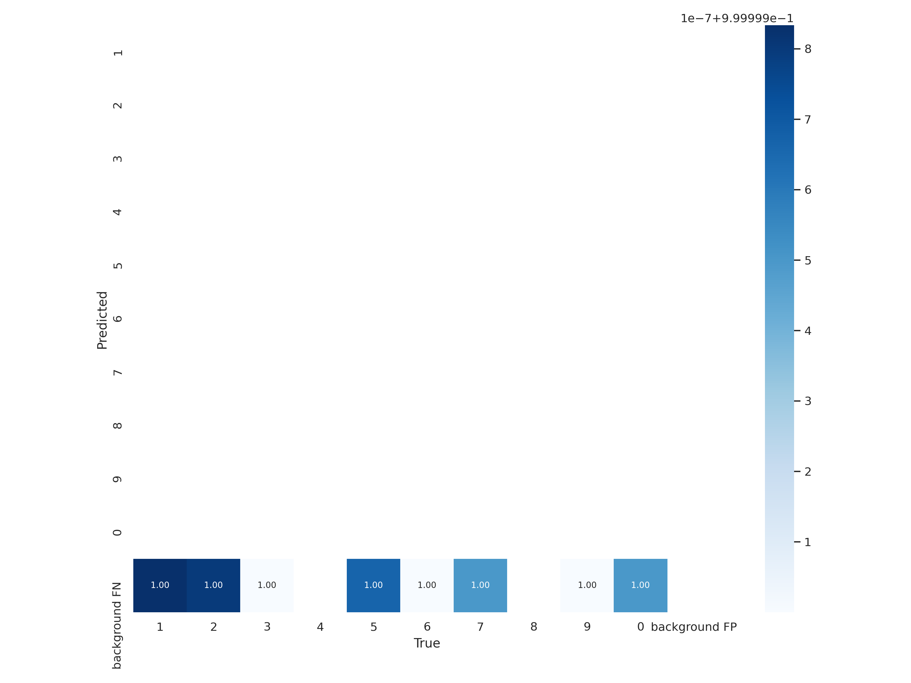

# Model-asisted Labeling with YOLOv5


## Background

Object Detection is great! ... if your labeled dataset already exists. I wanted to use machine learning to turn my regular rowing machine into a "smart" rowing machine (specifically: I want to track my workout stats).

I was unable to find a suitable existing set of labeled LCD digits.

After working through [a Roboflow tutorial]( https://models.roboflow.com/object-detection/yolov5), I started to use Roboflow to annotate  and store my images. Quickly, I resolved to use the model's outputs and labels for incoming images.

---

### Expected Inputs:
* ***Labels***: Assuming use of the [YOLOv5 format](https://github.com/AlexeyAB/Yolo_mark/issues/60).
* ***Images***: Assuming jpgs

Note about file names: Pairs are based on sharing a base filename. For example `image.jpg`/`image.txt` will be paired and `other_image5.jpg'/`other_image5.txt`.

### Expected Use:

Produce the predicted annotations for a new set of images.

(I ended up building a [key-driven image labeler](https://github.com/PhilBrockman/autobbox) to modify my model's predictions, but that codebase is no longer being maintained. I personally used Roboflow to both store my images and subsequently annotate as I got started wit this project.)

# Preparing Repository

Start by cloning https://github.com/ultralytics/yolov5.

```python
from ModelAssistedLabel.core import Defaults

os.chdir(Defaults().root)
Defaults.prepare_YOLOv5()
```

    Setup complete. Using torch 1.8.0+cu101 _CudaDeviceProperties(name='Tesla V100-SXM2-16GB', major=7, minor=0, total_memory=16160MB, multi_processor_count=80)


# Image Sets

### Vanilla image sets

Recursively search a folder (`repo`) that contains images and labels.

```python
wm.__cleanup__()
```

```python
repo = "/content/drive/MyDrive/Coding/Roboflow Export (841)"
name = "nospaces"
wm = AutoWeights(repo, name)
```

    summary:  [{'train': 4}, {'valid': 1}, {'test': 0}]
    checksum: 5
    target/dest /content/drive/MyDrive/Coding/Roboflow Export (841)/images/digittake-52-jpg_jpg.rf.798cf1dcc7a60cbff6c43f5587082f4f.jpg | ./train/images/digittake-52-jpg_jpg.rf.798cf1dcc7a60cbff6c43f5587082f4f.jpg
    target/dest /content/drive/MyDrive/Coding/Roboflow Export (841)/labels/digittake-52-jpg_jpg.rf.798cf1dcc7a60cbff6c43f5587082f4f.txt | ./train/labels/digittake-52-jpg_jpg.rf.798cf1dcc7a60cbff6c43f5587082f4f.txt
    target/dest /content/drive/MyDrive/Coding/Roboflow Export (841)/images/save_dirrsave_dirrcd4d249fd27369f927124e67151b8d97e4bdfdd4-jpg-jpg_jpg.rf.5659d1ef98ace2d9f22fa90d114bf7d6.jpg | ./train/images/save_dirrsave_dirrcd4d249fd27369f927124e67151b8d97e4bdfdd4-jpg-jpg_jpg.rf.5659d1ef98ace2d9f22fa90d114bf7d6.jpg
    target/dest /content/drive/MyDrive/Coding/Roboflow Export (841)/labels/save_dirrsave_dirrcd4d249fd27369f927124e67151b8d97e4bdfdd4-jpg-jpg_jpg.rf.5659d1ef98ace2d9f22fa90d114bf7d6.txt | ./train/labels/save_dirrsave_dirrcd4d249fd27369f927124e67151b8d97e4bdfdd4-jpg-jpg_jpg.rf.5659d1ef98ace2d9f22fa90d114bf7d6.txt
    target/dest /content/drive/MyDrive/Coding/Roboflow Export (841)/images/digittake-106-jpg_jpg.rf.780b7e954c1a7786ba65757732ba9bf6.jpg | ./train/images/digittake-106-jpg_jpg.rf.780b7e954c1a7786ba65757732ba9bf6.jpg
    target/dest /content/drive/MyDrive/Coding/Roboflow Export (841)/labels/digittake-106-jpg_jpg.rf.780b7e954c1a7786ba65757732ba9bf6.txt | ./train/labels/digittake-106-jpg_jpg.rf.780b7e954c1a7786ba65757732ba9bf6.txt
    target/dest /content/drive/MyDrive/Coding/Roboflow Export (841)/images/screenytake-44-jpg-cropped-jpg_jpg.rf.43df93e453f9a236285b3cdd0469bc6f.jpg | ./train/images/screenytake-44-jpg-cropped-jpg_jpg.rf.43df93e453f9a236285b3cdd0469bc6f.jpg
    target/dest /content/drive/MyDrive/Coding/Roboflow Export (841)/labels/screenytake-44-jpg-cropped-jpg_jpg.rf.43df93e453f9a236285b3cdd0469bc6f.txt | ./train/labels/screenytake-44-jpg-cropped-jpg_jpg.rf.43df93e453f9a236285b3cdd0469bc6f.txt
    target/dest /content/drive/MyDrive/Coding/Roboflow Export (841)/images/save_dirrtake-40-jpg-cropped-jpg-jpg_jpg.rf.296c8eb30772f8342ff64995ba9ad759.jpg | ./valid/images/save_dirrtake-40-jpg-cropped-jpg-jpg_jpg.rf.296c8eb30772f8342ff64995ba9ad759.jpg
    target/dest /content/drive/MyDrive/Coding/Roboflow Export (841)/labels/save_dirrtake-40-jpg-cropped-jpg-jpg_jpg.rf.296c8eb30772f8342ff64995ba9ad759.txt | ./valid/labels/save_dirrtake-40-jpg-cropped-jpg-jpg_jpg.rf.296c8eb30772f8342ff64995ba9ad759.txt


```python
%%time
wm.generate_weights(10)
```

    CPU times: user 2.02 ms, sys: 23.9 ms, total: 25.9 ms
    Wall time: 30.9 s


    './nospaces4-025678'


```python
!nbdev_diff_nbs
```

    diff -ru /tmp/tmpn2n1pcbx/core.py /tmp/tmp_1slz0sp/core.py
    --- /tmp/tmpn2n1pcbx/core.py	2021-03-16 21:49:10.000000000 +0000
    +++ /tmp/tmp_1slz0sp/core.py	2021-03-16 22:04:30.000000000 +0000
    @@ -1,4 +1,4 @@
    -# AUTOGENERATED! DO NOT EDIT! File to edit: 03_make_weights.ipynb (unless otherwise specified).
    +# AUTOGENERATED! DO NOT EDIT! File to edit: 03_augments.ipynb (unless otherwise specified).
     
     __all__ = ['Defaults', 'FileUtilities', 'Generation', 'Trainer', 'AutoWeights']
     
    


```python
!ls "{wm.last_results_path}"
```

    confusion_matrix.png				    results.txt
    events.out.tfevents.1615931373.99e938482867.3591.0  test_batch0_labels.jpg
    hyp.yaml					    test_batch0_pred.jpg
    labels_correlogram.jpg				    train_batch0.jpg
    labels.jpg					    train_batch1.jpg
    opt.yaml					    train_batch2.jpg
    results.png					    weights


```python
import PIL
PIL.Image.open(f"{wm.last_results_path}/confusion_matrix.png")
```





```python
ls
```

     00_config.ipynb         ModelAssistedLabel/
     01_split.ipynb          nospaces4-025678/
     02_train.ipynb          README.md
     03_make_weights.ipynb  'Roboflow Export (841)nospaces 21-03-16 21-34-54'/
     CONTRIBUTING.md         settings.ini
     docker-compose.yml      setup.py
     docs/                   _Synch.ipynb
     index.ipynb            'train (1)'/
     LICENSE                'train (2)'/
     Makefile                yolov5/
     MANIFEST.in


### Augmenting an image set
