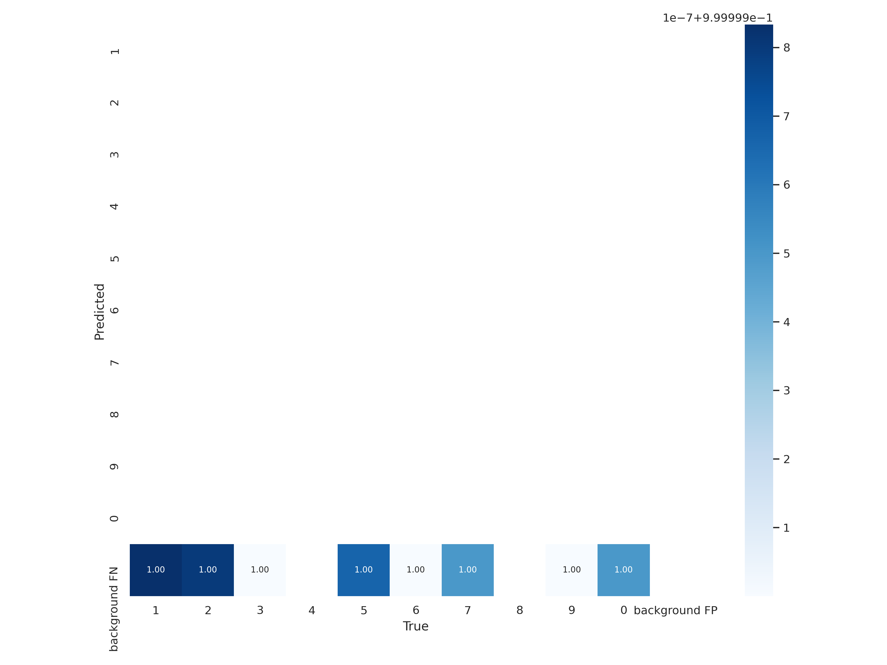

# Model-asisted Labeling with YOLOv5


## Background

Object Detection is great! ... if your labeled dataset already exists. I wanted to use machine learning to turn my regular rowing machine into a "smart" rowing machine (specifically: I want to track my workout stats).

I was unable to find a suitable existing set of labeled LCD digits.

After working through [a Roboflow tutorial]( https://models.roboflow.com/object-detection/yolov5), I started to use Roboflow to annotate  and store my images. Quickly, I resolved to use the model's outputs and labels for incoming images.

---

### Expected Inputs:
* ***Labels***: Assuming use of the [YOLOv5 format](https://github.com/AlexeyAB/Yolo_mark/issues/60).
* ***Images***: Assuming jpgs

Note about file names: Pairs are based on sharing a base filename. For example `image.jpg`/`image.txt` will be paired and `other_image5.jpg'/`other_image5.txt`.

### Expected Use:

Produce the predicted annotations for a new set of images.

(I ended up building a [key-driven image labeler](https://github.com/PhilBrockman/autobbox) to modify my model's predictions, but that codebase is no longer being maintained. I personally used Roboflow to both store my images and subsequently annotate as I got started wit this project.)

# Preparing Repository

Start by cloning https://github.com/ultralytics/yolov5.

```
from ModelAssistedLabel.core import Defaults

os.chdir(Defaults().root)
Defaults.prepare_YOLOv5()
```

    Setup complete. Using torch 1.8.0+cu101 _CudaDeviceProperties(name='Tesla V100-SXM2-16GB', major=7, minor=0, total_memory=16160MB, multi_processor_count=80)


# Image Sets

### Vanilla image sets

Recursively search a folder (`repo`) that contains images and labels.

```
wm.__cleanup__()
```

```
repo = "/content/drive/MyDrive/Coding/Roboflow Export (841)"
name = "nospaces"
wm = AutoWeights(repo, name)
```

    summary:  [{'train': 4}, {'valid': 1}, {'test': 0}]
    checksum: 5
    target/dest /content/drive/MyDrive/Coding/Roboflow Export (841)/images/digittake-52-jpg_jpg.rf.798cf1dcc7a60cbff6c43f5587082f4f.jpg | ./train/images/digittake-52-jpg_jpg.rf.798cf1dcc7a60cbff6c43f5587082f4f.jpg
    target/dest /content/drive/MyDrive/Coding/Roboflow Export (841)/labels/digittake-52-jpg_jpg.rf.798cf1dcc7a60cbff6c43f5587082f4f.txt | ./train/labels/digittake-52-jpg_jpg.rf.798cf1dcc7a60cbff6c43f5587082f4f.txt
    target/dest /content/drive/MyDrive/Coding/Roboflow Export (841)/images/save_dirrsave_dirrcd4d249fd27369f927124e67151b8d97e4bdfdd4-jpg-jpg_jpg.rf.5659d1ef98ace2d9f22fa90d114bf7d6.jpg | ./train/images/save_dirrsave_dirrcd4d249fd27369f927124e67151b8d97e4bdfdd4-jpg-jpg_jpg.rf.5659d1ef98ace2d9f22fa90d114bf7d6.jpg
    target/dest /content/drive/MyDrive/Coding/Roboflow Export (841)/labels/save_dirrsave_dirrcd4d249fd27369f927124e67151b8d97e4bdfdd4-jpg-jpg_jpg.rf.5659d1ef98ace2d9f22fa90d114bf7d6.txt | ./train/labels/save_dirrsave_dirrcd4d249fd27369f927124e67151b8d97e4bdfdd4-jpg-jpg_jpg.rf.5659d1ef98ace2d9f22fa90d114bf7d6.txt
    target/dest /content/drive/MyDrive/Coding/Roboflow Export (841)/images/digittake-106-jpg_jpg.rf.780b7e954c1a7786ba65757732ba9bf6.jpg | ./train/images/digittake-106-jpg_jpg.rf.780b7e954c1a7786ba65757732ba9bf6.jpg
    target/dest /content/drive/MyDrive/Coding/Roboflow Export (841)/labels/digittake-106-jpg_jpg.rf.780b7e954c1a7786ba65757732ba9bf6.txt | ./train/labels/digittake-106-jpg_jpg.rf.780b7e954c1a7786ba65757732ba9bf6.txt
    target/dest /content/drive/MyDrive/Coding/Roboflow Export (841)/images/screenytake-44-jpg-cropped-jpg_jpg.rf.43df93e453f9a236285b3cdd0469bc6f.jpg | ./train/images/screenytake-44-jpg-cropped-jpg_jpg.rf.43df93e453f9a236285b3cdd0469bc6f.jpg
    target/dest /content/drive/MyDrive/Coding/Roboflow Export (841)/labels/screenytake-44-jpg-cropped-jpg_jpg.rf.43df93e453f9a236285b3cdd0469bc6f.txt | ./train/labels/screenytake-44-jpg-cropped-jpg_jpg.rf.43df93e453f9a236285b3cdd0469bc6f.txt
    target/dest /content/drive/MyDrive/Coding/Roboflow Export (841)/images/save_dirrtake-40-jpg-cropped-jpg-jpg_jpg.rf.296c8eb30772f8342ff64995ba9ad759.jpg | ./valid/images/save_dirrtake-40-jpg-cropped-jpg-jpg_jpg.rf.296c8eb30772f8342ff64995ba9ad759.jpg
    target/dest /content/drive/MyDrive/Coding/Roboflow Export (841)/labels/save_dirrtake-40-jpg-cropped-jpg-jpg_jpg.rf.296c8eb30772f8342ff64995ba9ad759.txt | ./valid/labels/save_dirrtake-40-jpg-cropped-jpg-jpg_jpg.rf.296c8eb30772f8342ff64995ba9ad759.txt


```
%%time
wm.generate_weights(10)
```

    CPU times: user 2.02 ms, sys: 23.9 ms, total: 25.9 ms
    Wall time: 30.9 s


    './nospaces4-025678'


```
!nbdev_build_lib
!nbdev_build_docs
!nbdev_diff_nbs
```

    Converted 00_config.ipynb.
    Converted 01_split.ipynb.
    Converted 02_train.ipynb.
    Converted 03_augments.ipynb.
    Converted index.ipynb.
    converting: /content/drive/My Drive/Coding/ModelAssistedLabel/index.ipynb
    converting: /content/drive/My Drive/Coding/ModelAssistedLabel/03_augments.ipynb
    converting /content/drive/My Drive/Coding/ModelAssistedLabel/index.ipynb to README.md
    


```
!git status
```

    On branch master
    Your branch is up to date with 'origin/master'.
    
    Changes to be committed:
      (use "git reset HEAD <file>..." to unstage)
    
    	modified:   index.ipynb
    
    Changes not staged for commit:
      (use "git add/rm <file>..." to update what will be committed)
      (use "git checkout -- <file>..." to discard changes in working directory)
      (commit or discard the untracked or modified content in submodules)
    
    	deleted:    00_ultralytics.ipynb
    	deleted:    03_make_weights.ipynb
    	deleted:    nospaces7-015663/confusion_matrix.png
    	deleted:    nospaces7-015663/events.out.tfevents.1615918698.a1fc836e6b08.816.0
    	deleted:    nospaces7-015663/hyp.yaml
    	deleted:    nospaces7-015663/labels.jpg
    	deleted:    nospaces7-015663/labels_correlogram.jpg
    	deleted:    nospaces7-015663/opt.yaml
    	deleted:    nospaces7-015663/results.png
    	deleted:    nospaces7-015663/results.txt
    	deleted:    nospaces7-015663/test_batch0_labels.jpg
    	deleted:    nospaces7-015663/test_batch0_pred.jpg
    	deleted:    nospaces7-015663/train_batch0.jpg
    	deleted:    nospaces7-015663/train_batch1.jpg
    	deleted:    nospaces7-015663/train_batch2.jpg
    	deleted:    nospaces7-015663/weights/best.pt
    	deleted:    nospaces7-015663/weights/last.pt
    	deleted:    nospaces7-868139/confusion_matrix.png
    	deleted:    nospaces7-868139/events.out.tfevents.1615918481.a1fc836e6b08.535.0
    	deleted:    nospaces7-868139/hyp.yaml
    	deleted:    nospaces7-868139/labels.jpg
    	deleted:    nospaces7-868139/labels_correlogram.jpg
    	deleted:    nospaces7-868139/opt.yaml
    	deleted:    nospaces7-868139/results.png
    	deleted:    nospaces7-868139/results.txt
    	deleted:    nospaces7-868139/test_batch0_labels.jpg
    	deleted:    nospaces7-868139/test_batch0_pred.jpg
    	deleted:    nospaces7-868139/train_batch0.jpg
    	deleted:    nospaces7-868139/train_batch1.jpg
    	deleted:    nospaces7-868139/train_batch2.jpg
    	deleted:    nospaces7-868139/weights/best.pt
    	deleted:    nospaces7-868139/weights/last.pt
    	deleted:    nospaces7-896351/confusion_matrix.png
    	deleted:    nospaces7-896351/events.out.tfevents.1615920176.a1fc836e6b08.1290.0
    	deleted:    nospaces7-896351/hyp.yaml
    	deleted:    nospaces7-896351/labels.jpg
    	deleted:    nospaces7-896351/labels_correlogram.jpg
    	deleted:    nospaces7-896351/opt.yaml
    	deleted:    nospaces7-896351/results.png
    	deleted:    nospaces7-896351/results.txt
    	deleted:    nospaces7-896351/test_batch0_labels.jpg
    	deleted:    nospaces7-896351/test_batch0_pred.jpg
    	deleted:    nospaces7-896351/train_batch0.jpg
    	deleted:    nospaces7-896351/train_batch1.jpg
    	deleted:    nospaces7-896351/train_batch2.jpg
    	deleted:    nospaces7-896351/weights/best.pt
    	deleted:    nospaces7-896351/weights/last.pt
    	modified:   yolov5 (modified content, untracked content)
    


```
ls
```

    00_config.ipynb  docker-compose.yml  Makefile             settings.ini
    01_split.ipynb   docs/               MANIFEST.in          setup.py
    02_train.ipynb   index.ipynb         ModelAssistedLabel/  _Synch.ipynb
    CONTRIBUTING.md  LICENSE             README.md            yolov5/


```
!git add -u .
```

```
!git status
```

```
!git commit -m "clean repo (again)"
```

    [master e65bb9d] clean repo (again)
     48 files changed, 212 insertions(+), 575 deletions(-)
     delete mode 100644 00_ultralytics.ipynb
     delete mode 100644 03_make_weights.ipynb
     delete mode 100644 nospaces7-015663/confusion_matrix.png
     delete mode 100644 nospaces7-015663/events.out.tfevents.1615918698.a1fc836e6b08.816.0
     delete mode 100644 nospaces7-015663/hyp.yaml
     delete mode 100644 nospaces7-015663/labels.jpg
     delete mode 100644 nospaces7-015663/labels_correlogram.jpg
     delete mode 100644 nospaces7-015663/opt.yaml
     delete mode 100644 nospaces7-015663/results.png
     delete mode 100644 nospaces7-015663/results.txt
     delete mode 100644 nospaces7-015663/test_batch0_labels.jpg
     delete mode 100644 nospaces7-015663/test_batch0_pred.jpg
     delete mode 100644 nospaces7-015663/train_batch0.jpg
     delete mode 100644 nospaces7-015663/train_batch1.jpg
     delete mode 100644 nospaces7-015663/train_batch2.jpg
     delete mode 100644 nospaces7-015663/weights/best.pt
     delete mode 100644 nospaces7-015663/weights/last.pt
     delete mode 100644 nospaces7-868139/confusion_matrix.png
     delete mode 100644 nospaces7-868139/events.out.tfevents.1615918481.a1fc836e6b08.535.0
     delete mode 100644 nospaces7-868139/hyp.yaml
     delete mode 100644 nospaces7-868139/labels.jpg
     delete mode 100644 nospaces7-868139/labels_correlogram.jpg
     delete mode 100644 nospaces7-868139/opt.yaml
     delete mode 100644 nospaces7-868139/results.png
     delete mode 100644 nospaces7-868139/results.txt
     delete mode 100644 nospaces7-868139/test_batch0_labels.jpg
     delete mode 100644 nospaces7-868139/test_batch0_pred.jpg
     delete mode 100644 nospaces7-868139/train_batch0.jpg
     delete mode 100644 nospaces7-868139/train_batch1.jpg
     delete mode 100644 nospaces7-868139/train_batch2.jpg
     delete mode 100644 nospaces7-868139/weights/best.pt
     delete mode 100644 nospaces7-868139/weights/last.pt
     delete mode 100644 nospaces7-896351/confusion_matrix.png
     delete mode 100644 nospaces7-896351/events.out.tfevents.1615920176.a1fc836e6b08.1290.0
     delete mode 100644 nospaces7-896351/hyp.yaml
     delete mode 100644 nospaces7-896351/labels.jpg
     delete mode 100644 nospaces7-896351/labels_correlogram.jpg
     delete mode 100644 nospaces7-896351/opt.yaml
     delete mode 100644 nospaces7-896351/results.png
     delete mode 100644 nospaces7-896351/results.txt
     delete mode 100644 nospaces7-896351/test_batch0_labels.jpg
     delete mode 100644 nospaces7-896351/test_batch0_pred.jpg
     delete mode 100644 nospaces7-896351/train_batch0.jpg
     delete mode 100644 nospaces7-896351/train_batch1.jpg
     delete mode 100644 nospaces7-896351/train_batch2.jpg
     delete mode 100644 nospaces7-896351/weights/best.pt
     delete mode 100644 nospaces7-896351/weights/last.pt


```
!git push 
```

    Counting objects: 3, done.
    Delta compression using up to 2 threads.
    Compressing objects: 100% (3/3), done.
    Writing objects: 100% (3/3), 1.57 KiB | 201.00 KiB/s, done.
    Total 3 (delta 2), reused 0 (delta 0)
    remote: Resolving deltas: 100% (2/2), completed with 2 local objects.
    To https://github.com/PhilBrockman/ModelAssistedLabel.git
       f441157..e65bb9d  master -> master


```
!ls "{wm.last_results_path}"
```

    confusion_matrix.png				    results.txt
    events.out.tfevents.1615931373.99e938482867.3591.0  test_batch0_labels.jpg
    hyp.yaml					    test_batch0_pred.jpg
    labels_correlogram.jpg				    train_batch0.jpg
    labels.jpg					    train_batch1.jpg
    opt.yaml					    train_batch2.jpg
    results.png					    weights


```
import PIL
PIL.Image.open(f"{wm.last_results_path}/confusion_matrix.png")
```





```
ls
```

     00_config.ipynb         ModelAssistedLabel/
     01_split.ipynb          nospaces4-025678/
     02_train.ipynb          README.md
     03_make_weights.ipynb  'Roboflow Export (841)nospaces 21-03-16 21-34-54'/
     CONTRIBUTING.md         settings.ini
     docker-compose.yml      setup.py
     docs/                   _Synch.ipynb
     index.ipynb            'train (1)'/
     LICENSE                'train (2)'/
     Makefile                yolov5/
     MANIFEST.in


### Augmenting an image set
