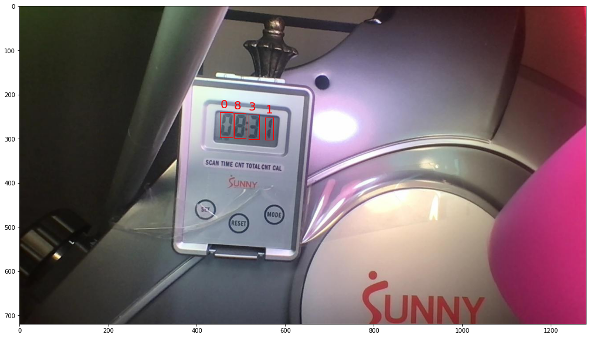

# Model-asisted Labeling with YOLOv5
> bootstrapping image annotation


```python
!git pull
```

    remote: Enumerating objects: 5, done.
    remote: Counting objects: 100% (5/5), done.
    remote: Compressing objects: 100% (2/2), done.
    remote: Total 5 (delta 3), reused 5 (delta 3), pack-reused 0
    Unpacking objects: 100% (5/5), done.
    From https://github.com/PhilBrockman/ModelAssistedLabel
       4c1b873..9f97920  master     -> origin/master
    Updating 4c1b873..9f97920
    Fast-forward
     .gitignore                                         |   2 +-
     ...jpg_jpg.rf.cac4ee0d1a8cf4b781ef1aade6171944.jpg | Bin 31981 -> 0 bytes
     ...jpg_jpg.rf.8bae964e97069305519d1d790c6c1926.jpg | Bin 29823 -> 0 bytes
     ...jpg_jpg.rf.0c4ece020756644ec3dee4d7b0ec7570.jpg | Bin 31878 -> 0 bytes
     ...jpg_jpg.rf.c3cb2b22a41b92335e71cbec20fcddd9.jpg | Bin 30549 -> 0 bytes
     ...jpg_jpg.rf.189a46a59d264e87dd70d256d8234d1a.jpg | Bin 30326 -> 0 bytes
     ...jpg_jpg.rf.6dbc43596d1194b234ea70f3a370c907.jpg | Bin 30059 -> 0 bytes
     ...jpg_jpg.rf.7f7c512bf6e8896399fe8d6be661f959.jpg | Bin 31802 -> 0 bytes
     ...jpg_jpg.rf.610249ba6ae5a8ea2fae8ade55181e79.jpg | Bin 31718 -> 0 bytes
     ...jpg_jpg.rf.99336f3053c3237faed2a80e8f686966.jpg | Bin 29256 -> 0 bytes
     ...jpg_jpg.rf.be25feff4b722ee07f904929da83120b.jpg | Bin 31552 -> 0 bytes
     ...jpg_jpg.rf.29999f0b5bce05df98aabfb5c18c8278.jpg | Bin 29318 -> 0 bytes
     ...jpg_jpg.rf.d4020369553beb1585eea80e9eed7dad.jpg | Bin 30164 -> 0 bytes
     ...jpg_jpg.rf.990bb1b3db89338db4b4b08a8c17b151.jpg | Bin 29269 -> 0 bytes
     ...jpg_jpg.rf.720b3334d89a9377ad5b128529ac296e.jpg | Bin 29727 -> 0 bytes
     ...jpg_jpg.rf.8e675a68295352b621f954a1c77848f4.jpg | Bin 29634 -> 0 bytes
     ...jpg_jpg.rf.1724b7b95cea1f0184b0765f3c874a9e.jpg | Bin 30210 -> 0 bytes
     ...jpg_jpg.rf.379b41f040da918d9880e4457fbb00ed.jpg | Bin 29966 -> 0 bytes
     ...jpg_jpg.rf.a04811832ba366c43fe76330f9922b71.jpg | Bin 29529 -> 0 bytes
     ...jpg_jpg.rf.53bcf1bbf4002e3fe8327c6e7d6b9bdb.jpg | Bin 29648 -> 0 bytes
     ...jpg_jpg.rf.5ac546f1d8ab043dcf053861d777729a.jpg | Bin 29971 -> 0 bytes
     ...jpg_jpg.rf.5609649d7b367c112ce5fd4d0b345271.jpg | Bin 29757 -> 0 bytes
     ...jpg_jpg.rf.134356b8034ccaf574e2d0deaec78568.jpg | Bin 29606 -> 0 bytes
     ...jpg_jpg.rf.7a9d8bf042dbe719eaaa2cb8dff68248.jpg | Bin 30568 -> 0 bytes
     ...jpg_jpg.rf.5f2250f9e2c2b5b478316d1768f9ce6e.jpg | Bin 30558 -> 0 bytes
     ...jpg_jpg.rf.e7c67a25ed108f594a719603ea28cc70.jpg | Bin 30919 -> 0 bytes
     ...jpg_jpg.rf.3ec953d134bb308939554a0a29516af8.jpg | Bin 31031 -> 0 bytes
     ...jpg_jpg.rf.30e25c033dba4d660b0d448391876ae1.jpg | Bin 29541 -> 0 bytes
     ...jpg_jpg.rf.b4bfb7a0db492435b840d4fc48492016.jpg | Bin 31004 -> 0 bytes
     ...jpg_jpg.rf.47e20e28ed6128d3080c7bc3057fa698.jpg | Bin 31123 -> 0 bytes
     ...jpg_jpg.rf.8c656d4294e517d82ced5ddeb3059920.jpg | Bin 31063 -> 0 bytes
     ...jpg_jpg.rf.3ae5428831bde14fba6d1e7107fcb562.jpg | Bin 30897 -> 0 bytes
     ...jpg_jpg.rf.dd25ee08b9e8261b4454505e909e4a19.jpg | Bin 31370 -> 0 bytes
     ...jpg_jpg.rf.9a40dabdab99df362a760b3e6bd446e5.jpg | Bin 30999 -> 0 bytes
     ...jpg_jpg.rf.4e67eb07d7a281765e74402cf78f6471.jpg | Bin 30899 -> 0 bytes
     ...jpg_jpg.rf.798ed0fe5d44f8cda21bd02763063787.jpg | Bin 29425 -> 0 bytes
     ...jpg_jpg.rf.8b38ac88bbb253baffb04aa50ac8df2a.jpg | Bin 29465 -> 0 bytes
     ...jpg_jpg.rf.dd8b6499b15494dc6fb53b32a6b14e30.jpg | Bin 29513 -> 0 bytes
     ...jpg_jpg.rf.1d35283b521f38ad923070c9a842220b.jpg | Bin 29590 -> 0 bytes
     ...jpg_jpg.rf.8c072334274cbbbf182bedab3cac20e1.jpg | Bin 29441 -> 0 bytes
     ...jpg_jpg.rf.94eed3cf9672c4656144aaaef92348bc.jpg | Bin 30255 -> 0 bytes
     ...jpg_jpg.rf.b3aa3e56915744acc6cb0d6996689cf4.jpg | Bin 30443 -> 0 bytes
     ...jpg_jpg.rf.4ca2f46e520a2740c1ee9e4be33c4750.jpg | Bin 30167 -> 0 bytes
     ...jpg_jpg.rf.d2b5ea619286f7cd5cad06fc0de2864e.jpg | Bin 30058 -> 0 bytes
     ...jpg_jpg.rf.068cd47f231923eb483e913cb024edbf.jpg | Bin 11747 -> 0 bytes
     ...jpg_jpg.rf.0a15208aae3af62061845fd39bcda794.jpg | Bin 26661 -> 0 bytes
     ...jpg_jpg.rf.1e9ec96784de76926635253e68ac58b5.jpg | Bin 27620 -> 0 bytes
     ...jpg_jpg.rf.354d1845656be3c316728ec0f68ff67d.jpg | Bin 23491 -> 0 bytes
     ...jpg_jpg.rf.45f85d3540bc991d5a17eaa81bb5108c.jpg | Bin 27673 -> 0 bytes
     ...jpg_jpg.rf.729a51122a990f331bc7a55f50f5bcae.jpg | Bin 25372 -> 0 bytes
     ...jpg_jpg.rf.89ee29085418151c90e69ad390407bc4.jpg | Bin 27085 -> 0 bytes
     ...jpg_jpg.rf.8e5c214282b88d1e275357286636fa36.jpg | Bin 25358 -> 0 bytes
     ...jpg_jpg.rf.f0d478fae784affc416576aa16fd59e7.jpg | Bin 23726 -> 0 bytes
     ...jpg_jpg.rf.fb02b25f56c6623124259b13279d24f4.jpg | Bin 27237 -> 0 bytes
     ...jpg_jpg.rf.e24e96541f6f60fac9d00b380145bb69.jpg | Bin 9762 -> 0 bytes
     ...jpg_jpg.rf.84b86c321727f58e7e32431e07903fd3.jpg | Bin 10944 -> 0 bytes
     ...jpg_jpg.rf.58c5ea5ffe32305598ec594124e24c33.jpg | Bin 9626 -> 0 bytes
     ...jpg_jpg.rf.c493ea7fce6fc0099a3ab423bd3b4bc2.jpg | Bin 11398 -> 0 bytes
     ...jpg_jpg.rf.a41a4e96dc629c422caab248cf6160b7.jpg | Bin 11159 -> 0 bytes
     ...jpg_jpg.rf.d0e36212d0fb33a65b6c2a2382e6bee1.jpg | Bin 8168 -> 0 bytes
     ...jpg_jpg.rf.f69ca31e7826868eee754ce5756d9bdf.jpg | Bin 15100 -> 0 bytes
     ...jpg_jpg.rf.50ae6a469d9fb7267785491f1b5a32a5.jpg | Bin 11782 -> 0 bytes
     ...jpg_jpg.rf.2cc14fb673440d0f858f6610a7433e61.jpg | Bin 9281 -> 0 bytes
     ...jpg_jpg.rf.4ce71aed27f78587a3b1d5fc909fb174.jpg | Bin 11968 -> 0 bytes
     ...jpg_jpg.rf.052becc7ea7f92709feb68c8568130a3.jpg | Bin 9158 -> 0 bytes
     ...jpg_jpg.rf.8f218fedd530aa1d967df86d9f068c3e.jpg | Bin 9384 -> 0 bytes
     ...jpg_jpg.rf.065298b9a6704381776e569ac0890438.jpg | Bin 10346 -> 0 bytes
     ...jpg_jpg.rf.1ee72c9d44bf2a9680bd8be9d8ccc301.jpg | Bin 9729 -> 0 bytes
     ...jpg_jpg.rf.10d3665648ef14056c7550621446113a.jpg | Bin 8699 -> 0 bytes
     ...jpg_jpg.rf.d6beb9545139e5981f33dc73d5828ecf.jpg | Bin 14605 -> 0 bytes
     ...jpg_jpg.rf.30bc2e49e1ca0e3dcab4f5c47178d600.jpg | Bin 14440 -> 0 bytes
     ...jpg_jpg.rf.fcf4cf04ecb8c3b54f7e4f7debe4dee3.jpg | Bin 14611 -> 0 bytes
     ...jpg_jpg.rf.874af45fc14e6c2c46c8d391de04b529.jpg | Bin 13705 -> 0 bytes
     ...jpg_jpg.rf.51f68418a65ed64add0fa3d885f62369.jpg | Bin 27951 -> 0 bytes
     ...jpg_jpg.rf.38f5cdb5eb4ef9fa1553da10fa1e3ea2.jpg | Bin 27631 -> 0 bytes
     ...jpg_jpg.rf.1fd369694cd4848db05df19f34144b5d.jpg | Bin 26732 -> 0 bytes
     ...jpg_jpg.rf.46fa136cb1d66b3a8783d7519f5fc237.jpg | Bin 27128 -> 0 bytes
     ...jpg_jpg.rf.b161449dc08095369f2fbc4cec0bb061.jpg | Bin 27049 -> 0 bytes
     ...jpg_jpg.rf.5a96256d25dbf41db264f590b48d583c.jpg | Bin 27234 -> 0 bytes
     ...jpg_jpg.rf.32c5d041f7e8d3af7732b9e1a6da23f7.jpg | Bin 27771 -> 0 bytes
     ...jpg_jpg.rf.52431525a8df960d1e777c49ac53bd81.jpg | Bin 27981 -> 0 bytes
     ...jpg_jpg.rf.3a794dff97da43d73829ed18e332ff6d.jpg | Bin 28039 -> 0 bytes
     ...jpg_jpg.rf.1f68bd4dbf75a3b37bc70ad26b079f55.jpg | Bin 27938 -> 0 bytes
     ...jpg_jpg.rf.31343f286fd43e04c215ac893575341b.jpg | Bin 27548 -> 0 bytes
     ...jpg_jpg.rf.670cd7049a0c5c3b47809cd16b9a8c17.jpg | Bin 27351 -> 0 bytes
     ...jpg_jpg.rf.b4574b0948f9686ccf4767be3d9313ae.jpg | Bin 24750 -> 0 bytes
     ...jpg_jpg.rf.14a527bab2f3be9b4e9889807c33e064.jpg | Bin 24412 -> 0 bytes
     ...jpg_jpg.rf.a4ff6f9570dd09467acb90fad458d492.jpg | Bin 25964 -> 0 bytes
     ...jpg_jpg.rf.c4948f4cdddfd711fe777ddef9e8bd1f.jpg | Bin 27764 -> 0 bytes
     ...jpg_jpg.rf.6df895ae2899a49ccceeb5dae36b1d54.jpg | Bin 27652 -> 0 bytes
     ...jpg_jpg.rf.e7dc9e74e6c349650b873b84fe733724.jpg | Bin 26579 -> 0 bytes
     ...jpg_jpg.rf.c9e41740e761b3279995dd5398121645.jpg | Bin 1633 -> 0 bytes
     ...jpg_jpg.rf.c24cccc3e40dd56046fd94b50a70fe30.jpg | Bin 1621 -> 0 bytes
     ...jpg_jpg.rf.a35b97aea028a43d0390c13349137a0c.jpg | Bin 1787 -> 0 bytes
     ...jpg_jpg.rf.16f1f5ad1e230d457fe3a94c5ba6b1b5.jpg | Bin 1913 -> 0 bytes
     ...jpg_jpg.rf.6230de72eb21372193b4eaef9ee7a6cf.jpg | Bin 1827 -> 0 bytes
     ...jpg_jpg.rf.6022746be5a6ab31a32ca20d5dbdda1e.jpg | Bin 1833 -> 0 bytes
     ...jpg_jpg.rf.89ddc99f4abeff9d718e61b4a507774a.jpg | Bin 1792 -> 0 bytes
     ...jpg_jpg.rf.9825c500b09dfaa7acfa3418f8a805e9.jpg | Bin 1874 -> 0 bytes
     ...jpg_jpg.rf.717d17b3a27223bfbd3b1dd56016b08d.jpg | Bin 1446 -> 0 bytes
     ...jpg_jpg.rf.428af624f2c7fa9b548299480bec3a8e.jpg | Bin 1464 -> 0 bytes
     ...jpg_jpg.rf.8d5bf299cdfaad17fbab346d42c80650.jpg | Bin 1403 -> 0 bytes
     ...jpg_jpg.rf.64543611f2971ae3a0530c7d47eed23c.jpg | Bin 1508 -> 0 bytes
     ...jpg_jpg.rf.3efb7f9902a934123dcc9e6d301402f5.jpg | Bin 1483 -> 0 bytes
     ...jpg_jpg.rf.ec0982b3d72ed5e48ac08b6cf0ab686d.jpg | Bin 1489 -> 0 bytes
     ...jpg_jpg.rf.8b8bddba1647a03d19993e212379aee9.jpg | Bin 1497 -> 0 bytes
     ...jpg_jpg.rf.4319b8c52ae1e4bffd8b5827fa188d24.jpg | Bin 1515 -> 0 bytes
     ...jpg_jpg.rf.ea63a63fc4c869986a3e78b0edfafb80.jpg | Bin 1673 -> 0 bytes
     ...jpg_jpg.rf.cac4ee0d1a8cf4b781ef1aade6171944.txt |   4 ----
     ...jpg_jpg.rf.8bae964e97069305519d1d790c6c1926.txt |   4 ----
     ...jpg_jpg.rf.0c4ece020756644ec3dee4d7b0ec7570.txt |   4 ----
     ...jpg_jpg.rf.c3cb2b22a41b92335e71cbec20fcddd9.txt |   4 ----
     ...jpg_jpg.rf.189a46a59d264e87dd70d256d8234d1a.txt |   4 ----
     ...jpg_jpg.rf.6dbc43596d1194b234ea70f3a370c907.txt |   4 ----
     ...jpg_jpg.rf.0c5e1f04b42f1e6fea5bda6ca0e4404b.txt |   4 ----
     ...jpg_jpg.rf.7f7c512bf6e8896399fe8d6be661f959.txt |   4 ----
     ...jpg_jpg.rf.610249ba6ae5a8ea2fae8ade55181e79.txt |   4 ----
     ...jpg_jpg.rf.99336f3053c3237faed2a80e8f686966.txt |   4 ----
     ...jpg_jpg.rf.be25feff4b722ee07f904929da83120b.txt |   4 ----
     ...jpg_jpg.rf.29999f0b5bce05df98aabfb5c18c8278.txt |   4 ----
     ...jpg_jpg.rf.d4020369553beb1585eea80e9eed7dad.txt |   4 ----
     ...jpg_jpg.rf.990bb1b3db89338db4b4b08a8c17b151.txt |   4 ----
     ...jpg_jpg.rf.b4bb80a194a6dcc40c9d6f0270f3bd86.txt |   4 ----
     ...jpg_jpg.rf.720b3334d89a9377ad5b128529ac296e.txt |   4 ----
     ...jpg_jpg.rf.8e675a68295352b621f954a1c77848f4.txt |   4 ----
     ...jpg_jpg.rf.1724b7b95cea1f0184b0765f3c874a9e.txt |   4 ----
     ...jpg_jpg.rf.379b41f040da918d9880e4457fbb00ed.txt |   4 ----
     ...jpg_jpg.rf.a04811832ba366c43fe76330f9922b71.txt |   4 ----
     ...jpg_jpg.rf.53bcf1bbf4002e3fe8327c6e7d6b9bdb.txt |   4 ----
     ...jpg_jpg.rf.5ac546f1d8ab043dcf053861d777729a.txt |   4 ----
     ...jpg_jpg.rf.5609649d7b367c112ce5fd4d0b345271.txt |   4 ----
     ...jpg_jpg.rf.134356b8034ccaf574e2d0deaec78568.txt |   4 ----
     ...jpg_jpg.rf.7a9d8bf042dbe719eaaa2cb8dff68248.txt |   4 ----
     ...jpg_jpg.rf.5f2250f9e2c2b5b478316d1768f9ce6e.txt |   4 ----
     ...jpg_jpg.rf.e7c67a25ed108f594a719603ea28cc70.txt |   4 ----
     ...jpg_jpg.rf.3ec953d134bb308939554a0a29516af8.txt |   4 ----
     ...jpg_jpg.rf.30e25c033dba4d660b0d448391876ae1.txt |   4 ----
     ...jpg_jpg.rf.b4bfb7a0db492435b840d4fc48492016.txt |   4 ----
     ...jpg_jpg.rf.47e20e28ed6128d3080c7bc3057fa698.txt |   4 ----
     ...jpg_jpg.rf.8c656d4294e517d82ced5ddeb3059920.txt |   4 ----
     ...jpg_jpg.rf.3ae5428831bde14fba6d1e7107fcb562.txt |   4 ----
     ...jpg_jpg.rf.dd25ee08b9e8261b4454505e909e4a19.txt |   4 ----
     ...jpg_jpg.rf.9a40dabdab99df362a760b3e6bd446e5.txt |   4 ----
     ...jpg_jpg.rf.4e67eb07d7a281765e74402cf78f6471.txt |   4 ----
     ...jpg_jpg.rf.798ed0fe5d44f8cda21bd02763063787.txt |   4 ----
     ...jpg_jpg.rf.8b38ac88bbb253baffb04aa50ac8df2a.txt |   4 ----
     ...jpg_jpg.rf.dd8b6499b15494dc6fb53b32a6b14e30.txt |   4 ----
     ...jpg_jpg.rf.1d35283b521f38ad923070c9a842220b.txt |   4 ----
     ...jpg_jpg.rf.8c072334274cbbbf182bedab3cac20e1.txt |   4 ----
     ...jpg_jpg.rf.94eed3cf9672c4656144aaaef92348bc.txt |   4 ----
     ...jpg_jpg.rf.b3aa3e56915744acc6cb0d6996689cf4.txt |   4 ----
     ...jpg_jpg.rf.4ca2f46e520a2740c1ee9e4be33c4750.txt |   4 ----
     ...jpg_jpg.rf.d2b5ea619286f7cd5cad06fc0de2864e.txt |   4 ----
     ...jpg_jpg.rf.068cd47f231923eb483e913cb024edbf.txt |   5 -----
     ...jpg_jpg.rf.0a15208aae3af62061845fd39bcda794.txt |  21 ---------------------
     ...jpg_jpg.rf.1e9ec96784de76926635253e68ac58b5.txt |  21 ---------------------
     ...jpg_jpg.rf.354d1845656be3c316728ec0f68ff67d.txt |  19 -------------------
     ...jpg_jpg.rf.45f85d3540bc991d5a17eaa81bb5108c.txt |  20 --------------------
     ...jpg_jpg.rf.729a51122a990f331bc7a55f50f5bcae.txt |  19 -------------------
     ...jpg_jpg.rf.89ee29085418151c90e69ad390407bc4.txt |  20 --------------------
     ...jpg_jpg.rf.8e5c214282b88d1e275357286636fa36.txt |  19 -------------------
     ...jpg_jpg.rf.f0d478fae784affc416576aa16fd59e7.txt |  19 -------------------
     ...jpg_jpg.rf.fb02b25f56c6623124259b13279d24f4.txt |  19 -------------------
     ...jpg_jpg.rf.e24e96541f6f60fac9d00b380145bb69.txt |   5 -----
     ...jpg_jpg.rf.84b86c321727f58e7e32431e07903fd3.txt |   5 -----
     ...jpg_jpg.rf.58c5ea5ffe32305598ec594124e24c33.txt |   5 -----
     ...jpg_jpg.rf.c493ea7fce6fc0099a3ab423bd3b4bc2.txt |   5 -----
     ...jpg_jpg.rf.a41a4e96dc629c422caab248cf6160b7.txt |   4 ----
     ...jpg_jpg.rf.d0e36212d0fb33a65b6c2a2382e6bee1.txt |   4 ----
     ...jpg_jpg.rf.f69ca31e7826868eee754ce5756d9bdf.txt |   5 -----
     ...jpg_jpg.rf.50ae6a469d9fb7267785491f1b5a32a5.txt |   5 -----
     ...jpg_jpg.rf.4ce71aed27f78587a3b1d5fc909fb174.txt |   5 -----
     ...jpg_jpg.rf.052becc7ea7f92709feb68c8568130a3.txt |   4 ----
     ...jpg_jpg.rf.8f218fedd530aa1d967df86d9f068c3e.txt |   4 ----
     ...jpg_jpg.rf.065298b9a6704381776e569ac0890438.txt |   4 ----
     ...jpg_jpg.rf.1ee72c9d44bf2a9680bd8be9d8ccc301.txt |   5 -----
     ...jpg_jpg.rf.10d3665648ef14056c7550621446113a.txt |   4 ----
     ...jpg_jpg.rf.d6beb9545139e5981f33dc73d5828ecf.txt |   4 ----
     ...jpg_jpg.rf.30bc2e49e1ca0e3dcab4f5c47178d600.txt |   4 ----
     ...jpg_jpg.rf.fcf4cf04ecb8c3b54f7e4f7debe4dee3.txt |   4 ----
     ...jpg_jpg.rf.874af45fc14e6c2c46c8d391de04b529.txt |   4 ----
     ...jpg_jpg.rf.51f68418a65ed64add0fa3d885f62369.txt |  20 --------------------
     ...jpg_jpg.rf.032c93554ffb0a285526604c75b02446.txt |  20 --------------------
     ...jpg_jpg.rf.38f5cdb5eb4ef9fa1553da10fa1e3ea2.txt |  20 --------------------
     ...jpg_jpg.rf.1fd369694cd4848db05df19f34144b5d.txt |  20 --------------------
     ...jpg_jpg.rf.46fa136cb1d66b3a8783d7519f5fc237.txt |  20 --------------------
     ...jpg_jpg.rf.b161449dc08095369f2fbc4cec0bb061.txt |  20 --------------------
     ...jpg_jpg.rf.5a96256d25dbf41db264f590b48d583c.txt |  20 --------------------
     ...jpg_jpg.rf.32c5d041f7e8d3af7732b9e1a6da23f7.txt |  20 --------------------
     ...jpg_jpg.rf.52431525a8df960d1e777c49ac53bd81.txt |  19 -------------------
     ...jpg_jpg.rf.3a794dff97da43d73829ed18e332ff6d.txt |  20 --------------------
     ...jpg_jpg.rf.1f68bd4dbf75a3b37bc70ad26b079f55.txt |  20 --------------------
     ...jpg_jpg.rf.31343f286fd43e04c215ac893575341b.txt |  20 --------------------
     ...jpg_jpg.rf.670cd7049a0c5c3b47809cd16b9a8c17.txt |  19 -------------------
     ...jpg_jpg.rf.b4574b0948f9686ccf4767be3d9313ae.txt |  21 ---------------------
     ...jpg_jpg.rf.14a527bab2f3be9b4e9889807c33e064.txt |  20 --------------------
     ...jpg_jpg.rf.a4ff6f9570dd09467acb90fad458d492.txt |  21 ---------------------
     ...jpg_jpg.rf.c4948f4cdddfd711fe777ddef9e8bd1f.txt |  20 --------------------
     ...jpg_jpg.rf.6df895ae2899a49ccceeb5dae36b1d54.txt |  20 --------------------
     ...jpg_jpg.rf.e7dc9e74e6c349650b873b84fe733724.txt |  19 -------------------
     ...jpg_jpg.rf.c9e41740e761b3279995dd5398121645.txt |   4 ----
     ...jpg_jpg.rf.c24cccc3e40dd56046fd94b50a70fe30.txt |   4 ----
     ...jpg_jpg.rf.a35b97aea028a43d0390c13349137a0c.txt |   4 ----
     ...jpg_jpg.rf.16f1f5ad1e230d457fe3a94c5ba6b1b5.txt |   4 ----
     ...jpg_jpg.rf.6230de72eb21372193b4eaef9ee7a6cf.txt |   4 ----
     ...jpg_jpg.rf.6022746be5a6ab31a32ca20d5dbdda1e.txt |   4 ----
     ...jpg_jpg.rf.89ddc99f4abeff9d718e61b4a507774a.txt |   4 ----
     ...jpg_jpg.rf.9825c500b09dfaa7acfa3418f8a805e9.txt |   4 ----
     ...jpg_jpg.rf.717d17b3a27223bfbd3b1dd56016b08d.txt |   4 ----
     ...jpg_jpg.rf.428af624f2c7fa9b548299480bec3a8e.txt |   4 ----
     ...jpg_jpg.rf.8d5bf299cdfaad17fbab346d42c80650.txt |   4 ----
     ...jpg_jpg.rf.64543611f2971ae3a0530c7d47eed23c.txt |   4 ----
     ...jpg_jpg.rf.3efb7f9902a934123dcc9e6d301402f5.txt |   3 ---
     ...jpg_jpg.rf.ec0982b3d72ed5e48ac08b6cf0ab686d.txt |   4 ----
     ...jpg_jpg.rf.8b8bddba1647a03d19993e212379aee9.txt |   4 ----
     ...jpg_jpg.rf.4319b8c52ae1e4bffd8b5827fa188d24.txt |   4 ----
     ...jpg_jpg.rf.ea63a63fc4c869986a3e78b0edfafb80.txt |   4 ----
     217 files changed, 1 insertion(+), 889 deletions(-)
     delete mode 100644 train (1)/images/digittake-105-jpg_jpg.rf.cac4ee0d1a8cf4b781ef1aade6171944.jpg
     delete mode 100644 train (1)/images/digittake-107-jpg_jpg.rf.8bae964e97069305519d1d790c6c1926.jpg
     delete mode 100644 train (1)/images/digittake-114-jpg_jpg.rf.0c4ece020756644ec3dee4d7b0ec7570.jpg
     delete mode 100644 train (1)/images/digittake-117-jpg_jpg.rf.c3cb2b22a41b92335e71cbec20fcddd9.jpg
     delete mode 100644 train (1)/images/digittake-120-jpg_jpg.rf.189a46a59d264e87dd70d256d8234d1a.jpg
     delete mode 100644 train (1)/images/digittake-122-jpg_jpg.rf.6dbc43596d1194b234ea70f3a370c907.jpg
     delete mode 100644 train (1)/images/digittake-124-jpg_jpg.rf.7f7c512bf6e8896399fe8d6be661f959.jpg
     delete mode 100644 train (1)/images/digittake-133-jpg_jpg.rf.610249ba6ae5a8ea2fae8ade55181e79.jpg
     delete mode 100644 train (1)/images/digittake-136-jpg_jpg.rf.99336f3053c3237faed2a80e8f686966.jpg
     delete mode 100644 train (1)/images/digittake-136-jpg_jpg.rf.be25feff4b722ee07f904929da83120b.jpg
     delete mode 100644 train (1)/images/digittake-137-jpg_jpg.rf.29999f0b5bce05df98aabfb5c18c8278.jpg
     delete mode 100644 train (1)/images/digittake-14-jpg_jpg.rf.d4020369553beb1585eea80e9eed7dad.jpg
     delete mode 100644 train (1)/images/digittake-155-jpg_jpg.rf.990bb1b3db89338db4b4b08a8c17b151.jpg
     delete mode 100644 train (1)/images/digittake-227-jpg_jpg.rf.720b3334d89a9377ad5b128529ac296e.jpg
     delete mode 100644 train (1)/images/digittake-228-jpg_jpg.rf.8e675a68295352b621f954a1c77848f4.jpg
     delete mode 100644 train (1)/images/digittake-24-jpg_jpg.rf.1724b7b95cea1f0184b0765f3c874a9e.jpg
     delete mode 100644 train (1)/images/digittake-240-jpg_jpg.rf.379b41f040da918d9880e4457fbb00ed.jpg
     delete mode 100644 train (1)/images/digittake-258-jpg_jpg.rf.a04811832ba366c43fe76330f9922b71.jpg
     delete mode 100644 train (1)/images/digittake-260-jpg_jpg.rf.53bcf1bbf4002e3fe8327c6e7d6b9bdb.jpg
     delete mode 100644 train (1)/images/digittake-273-jpg_jpg.rf.5ac546f1d8ab043dcf053861d777729a.jpg
     delete mode 100644 train (1)/images/digittake-291-jpg_jpg.rf.5609649d7b367c112ce5fd4d0b345271.jpg
     delete mode 100644 train (1)/images/digittake-308-jpg_jpg.rf.134356b8034ccaf574e2d0deaec78568.jpg
     delete mode 100644 train (1)/images/digittake-316-jpg_jpg.rf.7a9d8bf042dbe719eaaa2cb8dff68248.jpg
     delete mode 100644 train (1)/images/digittake-322-jpg_jpg.rf.5f2250f9e2c2b5b478316d1768f9ce6e.jpg
     delete mode 100644 train (1)/images/digittake-323-jpg_jpg.rf.e7c67a25ed108f594a719603ea28cc70.jpg
     delete mode 100644 train (1)/images/digittake-335-jpg_jpg.rf.3ec953d134bb308939554a0a29516af8.jpg
     delete mode 100644 train (1)/images/digittake-34-jpg_jpg.rf.30e25c033dba4d660b0d448391876ae1.jpg
     delete mode 100644 train (1)/images/digittake-340-jpg_jpg.rf.b4bfb7a0db492435b840d4fc48492016.jpg
     delete mode 100644 train (1)/images/digittake-343-jpg_jpg.rf.47e20e28ed6128d3080c7bc3057fa698.jpg
     delete mode 100644 train (1)/images/digittake-346-jpg_jpg.rf.8c656d4294e517d82ced5ddeb3059920.jpg
     delete mode 100644 train (1)/images/digittake-383-jpg_jpg.rf.3ae5428831bde14fba6d1e7107fcb562.jpg
     delete mode 100644 train (1)/images/digittake-392-jpg_jpg.rf.dd25ee08b9e8261b4454505e909e4a19.jpg
     delete mode 100644 train (1)/images/digittake-403-jpg_jpg.rf.9a40dabdab99df362a760b3e6bd446e5.jpg
     delete mode 100644 train (1)/images/digittake-409-jpg_jpg.rf.4e67eb07d7a281765e74402cf78f6471.jpg
     delete mode 100644 train (1)/images/digittake-51-jpg_jpg.rf.798ed0fe5d44f8cda21bd02763063787.jpg
     delete mode 100644 train (1)/images/digittake-57-jpg_jpg.rf.8b38ac88bbb253baffb04aa50ac8df2a.jpg
     delete mode 100644 train (1)/images/digittake-61-jpg_jpg.rf.dd8b6499b15494dc6fb53b32a6b14e30.jpg
     delete mode 100644 train (1)/images/digittake-63-jpg_jpg.rf.1d35283b521f38ad923070c9a842220b.jpg
     delete mode 100644 train (1)/images/digittake-73-jpg_jpg.rf.8c072334274cbbbf182bedab3cac20e1.jpg
     delete mode 100644 train (1)/images/digittake-81-jpg_jpg.rf.94eed3cf9672c4656144aaaef92348bc.jpg
     delete mode 100644 train (1)/images/digittake-91-jpg_jpg.rf.b3aa3e56915744acc6cb0d6996689cf4.jpg
     delete mode 100644 train (1)/images/digittake-92-jpg_jpg.rf.4ca2f46e520a2740c1ee9e4be33c4750.jpg
     delete mode 100644 train (1)/images/digittake-99-jpg_jpg.rf.d2b5ea619286f7cd5cad06fc0de2864e.jpg
     delete mode 100644 train (1)/images/save_dirrattempt2-save_dirattempt29879e8fcac36d3a82bea304b0af56bde5533f5f1-jpg-jpg_jpg.rf.068cd47f231923eb483e913cb024edbf.jpg
     delete mode 100644 train (1)/images/save_dirrcropped-jpg_jpg.rf.0a15208aae3af62061845fd39bcda794.jpg
     delete mode 100644 train (1)/images/save_dirrcropped-jpg_jpg.rf.1e9ec96784de76926635253e68ac58b5.jpg
     delete mode 100644 train (1)/images/save_dirrcropped-jpg_jpg.rf.354d1845656be3c316728ec0f68ff67d.jpg
     delete mode 100644 train (1)/images/save_dirrcropped-jpg_jpg.rf.45f85d3540bc991d5a17eaa81bb5108c.jpg
     delete mode 100644 train (1)/images/save_dirrcropped-jpg_jpg.rf.729a51122a990f331bc7a55f50f5bcae.jpg
     delete mode 100644 train (1)/images/save_dirrcropped-jpg_jpg.rf.89ee29085418151c90e69ad390407bc4.jpg
     delete mode 100644 train (1)/images/save_dirrcropped-jpg_jpg.rf.8e5c214282b88d1e275357286636fa36.jpg
     delete mode 100644 train (1)/images/save_dirrcropped-jpg_jpg.rf.f0d478fae784affc416576aa16fd59e7.jpg
     delete mode 100644 train (1)/images/save_dirrcropped-jpg_jpg.rf.fb02b25f56c6623124259b13279d24f4.jpg
     delete mode 100644 train (1)/images/save_dirrsave_dirr15c41a2e99339f2698e386e1370ac1471ae430e3-jpg-jpg_jpg.rf.e24e96541f6f60fac9d00b380145bb69.jpg
     delete mode 100644 train (1)/images/save_dirrsave_dirr1f1ec8eee75d4988d7756895aa780a6dee908118-jpg-jpg_jpg.rf.84b86c321727f58e7e32431e07903fd3.jpg
     delete mode 100644 train (1)/images/save_dirrsave_dirr1f27a79030d2b43055f03b2c77214f1c29681dcd-jpg-jpg_jpg.rf.58c5ea5ffe32305598ec594124e24c33.jpg
     delete mode 100644 train (1)/images/save_dirrsave_dirr28feeee4d7e52d0ba5d2cee31c8886e57f574319-jpg-jpg_jpg.rf.c493ea7fce6fc0099a3ab423bd3b4bc2.jpg
     delete mode 100644 train (1)/images/save_dirrsave_dirr32de75ac61ffc12b0a3c9a1e797682735c94f0b3-jpg-jpg_jpg.rf.a41a4e96dc629c422caab248cf6160b7.jpg
     delete mode 100644 train (1)/images/save_dirrsave_dirr34bd9ee3b020d9cd5297d6990784719bc68f2f2e-jpg-jpg_jpg.rf.d0e36212d0fb33a65b6c2a2382e6bee1.jpg
     delete mode 100644 train (1)/images/save_dirrsave_dirr4a322d88fca63d74fb42eee30846e99735c17905-jpg-jpg_jpg.rf.f69ca31e7826868eee754ce5756d9bdf.jpg
     delete mode 100644 train (1)/images/save_dirrsave_dirr4de40c9f2697c6f0ebc3be3a531bb5db9f64092f-jpg-jpg_jpg.rf.50ae6a469d9fb7267785491f1b5a32a5.jpg
     delete mode 100644 train (1)/images/save_dirrsave_dirrc2d2ca4a41d723ee42c407d1fdc86a542b597dc0-jpg-jpg_jpg.rf.2cc14fb673440d0f858f6610a7433e61.jpg
     delete mode 100644 train (1)/images/save_dirrsave_dirrcf9e98f7f7793bc13d41d24a7fce6ef600a57fa4-jpg-jpg_jpg.rf.4ce71aed27f78587a3b1d5fc909fb174.jpg
     delete mode 100644 train (1)/images/save_dirrsave_dirrd350bed5855bb0233e9f539da24ab4d9fd25eadf-jpg-jpg_jpg.rf.052becc7ea7f92709feb68c8568130a3.jpg
     delete mode 100644 train (1)/images/save_dirrsave_dirre452881a7b82c7b224e38b754424da1f3b96060d-jpg-jpg_jpg.rf.8f218fedd530aa1d967df86d9f068c3e.jpg
     delete mode 100644 train (1)/images/save_dirrsave_dirred19955cfa901c23e20ba492411e34906586436e-jpg-jpg_jpg.rf.065298b9a6704381776e569ac0890438.jpg
     delete mode 100644 train (1)/images/save_dirrsave_dirrfbd02b4f1eac089a9af1a9e0a24e888e3226d6bc-jpg-jpg_jpg.rf.1ee72c9d44bf2a9680bd8be9d8ccc301.jpg
     delete mode 100644 train (1)/images/save_dirrsave_dirrfc302f8fddf7e0a77550953f36d6a5148019680e-jpg-jpg_jpg.rf.10d3665648ef14056c7550621446113a.jpg
     delete mode 100644 train (1)/images/save_dirrscreenytake-34-jpg-cropped-jpg-jpg_jpg.rf.d6beb9545139e5981f33dc73d5828ecf.jpg
     delete mode 100644 train (1)/images/save_dirrscreenytake-40-jpg-cropped-jpg-jpg_jpg.rf.30bc2e49e1ca0e3dcab4f5c47178d600.jpg
     delete mode 100644 train (1)/images/save_dirrscreenytake-46-jpg-cropped-jpg-jpg_jpg.rf.fcf4cf04ecb8c3b54f7e4f7debe4dee3.jpg
     delete mode 100644 train (1)/images/save_dirrscreenytake-65-jpg-cropped-jpg-jpg_jpg.rf.874af45fc14e6c2c46c8d391de04b529.jpg
     delete mode 100644 train (1)/images/save_dirrtake-102-jpg-cropped-jpg-jpg_jpg.rf.51f68418a65ed64add0fa3d885f62369.jpg
     delete mode 100644 train (1)/images/save_dirrtake-112-jpg-cropped-jpg-jpg_jpg.rf.38f5cdb5eb4ef9fa1553da10fa1e3ea2.jpg
     delete mode 100644 train (1)/images/save_dirrtake-113-jpg-cropped-jpg-jpg_jpg.rf.1fd369694cd4848db05df19f34144b5d.jpg
     delete mode 100644 train (1)/images/save_dirrtake-120-jpg-cropped-jpg-jpg_jpg.rf.46fa136cb1d66b3a8783d7519f5fc237.jpg
     delete mode 100644 train (1)/images/save_dirrtake-122-jpg-cropped-jpg-jpg_jpg.rf.b161449dc08095369f2fbc4cec0bb061.jpg
     delete mode 100644 train (1)/images/save_dirrtake-123-jpg-cropped-jpg-jpg_jpg.rf.5a96256d25dbf41db264f590b48d583c.jpg
     delete mode 100644 train (1)/images/save_dirrtake-124-jpg-cropped-jpg-jpg_jpg.rf.32c5d041f7e8d3af7732b9e1a6da23f7.jpg
     delete mode 100644 train (1)/images/save_dirrtake-12_jpg_cropped-jpg_jpg.rf.52431525a8df960d1e777c49ac53bd81.jpg
     delete mode 100644 train (1)/images/save_dirrtake-133-jpg-cropped-jpg-jpg_jpg.rf.3a794dff97da43d73829ed18e332ff6d.jpg
     delete mode 100644 train (1)/images/save_dirrtake-17_jpg_cropped-jpg_jpg.rf.1f68bd4dbf75a3b37bc70ad26b079f55.jpg
     delete mode 100644 train (1)/images/save_dirrtake-18_jpg_cropped-jpg_jpg.rf.31343f286fd43e04c215ac893575341b.jpg
     delete mode 100644 train (1)/images/save_dirrtake-19_jpg_cropped-jpg_jpg.rf.670cd7049a0c5c3b47809cd16b9a8c17.jpg
     delete mode 100644 train (1)/images/save_dirrtake-25-jpg-cropped-jpg-jpg_jpg.rf.b4574b0948f9686ccf4767be3d9313ae.jpg
     delete mode 100644 train (1)/images/save_dirrtake-49_jpg_cropped-jpg_jpg.rf.14a527bab2f3be9b4e9889807c33e064.jpg
     delete mode 100644 train (1)/images/save_dirrtake-63-jpg-cropped-jpg-jpg_jpg.rf.a4ff6f9570dd09467acb90fad458d492.jpg
     delete mode 100644 train (1)/images/save_dirrtake-95-jpg-cropped-jpg-jpg_jpg.rf.c4948f4cdddfd711fe777ddef9e8bd1f.jpg
     delete mode 100644 train (1)/images/save_dirrtake-98-jpg-cropped-jpg-jpg_jpg.rf.6df895ae2899a49ccceeb5dae36b1d54.jpg
     delete mode 100644 train (1)/images/save_dirrtake-9_jpg_cropped-jpg_jpg.rf.e7dc9e74e6c349650b873b84fe733724.jpg
     delete mode 100644 train (1)/images/screenytake-10-jpg-cropped-jpg_jpg.rf.c9e41740e761b3279995dd5398121645.jpg
     delete mode 100644 train (1)/images/screenytake-12-jpg-cropped-jpg_jpg.rf.c24cccc3e40dd56046fd94b50a70fe30.jpg
     delete mode 100644 train (1)/images/screenytake-22-jpg-cropped-jpg_jpg.rf.a35b97aea028a43d0390c13349137a0c.jpg
     delete mode 100644 train (1)/images/screenytake-26-jpg-cropped-jpg_jpg.rf.16f1f5ad1e230d457fe3a94c5ba6b1b5.jpg
     delete mode 100644 train (1)/images/screenytake-27-jpg-cropped-jpg_jpg.rf.6230de72eb21372193b4eaef9ee7a6cf.jpg
     delete mode 100644 train (1)/images/screenytake-28-jpg-cropped-jpg_jpg.rf.6022746be5a6ab31a32ca20d5dbdda1e.jpg
     delete mode 100644 train (1)/images/screenytake-38-jpg-cropped-jpg_jpg.rf.89ddc99f4abeff9d718e61b4a507774a.jpg
     delete mode 100644 train (1)/images/screenytake-42-jpg-cropped-jpg_jpg.rf.9825c500b09dfaa7acfa3418f8a805e9.jpg
     delete mode 100644 train (1)/images/screenytake-50-jpg-cropped-jpg_jpg.rf.717d17b3a27223bfbd3b1dd56016b08d.jpg
     delete mode 100644 train (1)/images/screenytake-52-jpg-cropped-jpg_jpg.rf.428af624f2c7fa9b548299480bec3a8e.jpg
     delete mode 100644 train (1)/images/screenytake-53-jpg-cropped-jpg_jpg.rf.8d5bf299cdfaad17fbab346d42c80650.jpg
     delete mode 100644 train (1)/images/screenytake-55-jpg-cropped-jpg_jpg.rf.64543611f2971ae3a0530c7d47eed23c.jpg
     delete mode 100644 train (1)/images/screenytake-61-jpg-cropped-jpg_jpg.rf.3efb7f9902a934123dcc9e6d301402f5.jpg
     delete mode 100644 train (1)/images/screenytake-70-jpg-cropped-jpg_jpg.rf.ec0982b3d72ed5e48ac08b6cf0ab686d.jpg
     delete mode 100644 train (1)/images/screenytake-76-jpg-cropped-jpg_jpg.rf.8b8bddba1647a03d19993e212379aee9.jpg
     delete mode 100644 train (1)/images/screenytake-78-jpg-cropped-jpg_jpg.rf.4319b8c52ae1e4bffd8b5827fa188d24.jpg
     delete mode 100644 train (1)/images/screenytake-9-jpg-cropped-jpg_jpg.rf.ea63a63fc4c869986a3e78b0edfafb80.jpg
     delete mode 100644 train (1)/labels/digittake-105-jpg_jpg.rf.cac4ee0d1a8cf4b781ef1aade6171944.txt
     delete mode 100644 train (1)/labels/digittake-107-jpg_jpg.rf.8bae964e97069305519d1d790c6c1926.txt
     delete mode 100644 train (1)/labels/digittake-114-jpg_jpg.rf.0c4ece020756644ec3dee4d7b0ec7570.txt
     delete mode 100644 train (1)/labels/digittake-117-jpg_jpg.rf.c3cb2b22a41b92335e71cbec20fcddd9.txt
     delete mode 100644 train (1)/labels/digittake-120-jpg_jpg.rf.189a46a59d264e87dd70d256d8234d1a.txt
     delete mode 100644 train (1)/labels/digittake-122-jpg_jpg.rf.6dbc43596d1194b234ea70f3a370c907.txt
     delete mode 100644 train (1)/labels/digittake-124-jpg_jpg.rf.0c5e1f04b42f1e6fea5bda6ca0e4404b.txt
     delete mode 100644 train (1)/labels/digittake-124-jpg_jpg.rf.7f7c512bf6e8896399fe8d6be661f959.txt
     delete mode 100644 train (1)/labels/digittake-133-jpg_jpg.rf.610249ba6ae5a8ea2fae8ade55181e79.txt
     delete mode 100644 train (1)/labels/digittake-136-jpg_jpg.rf.99336f3053c3237faed2a80e8f686966.txt
     delete mode 100644 train (1)/labels/digittake-136-jpg_jpg.rf.be25feff4b722ee07f904929da83120b.txt
     delete mode 100644 train (1)/labels/digittake-137-jpg_jpg.rf.29999f0b5bce05df98aabfb5c18c8278.txt
     delete mode 100644 train (1)/labels/digittake-14-jpg_jpg.rf.d4020369553beb1585eea80e9eed7dad.txt
     delete mode 100644 train (1)/labels/digittake-155-jpg_jpg.rf.990bb1b3db89338db4b4b08a8c17b151.txt
     delete mode 100644 train (1)/labels/digittake-18-jpg_jpg.rf.b4bb80a194a6dcc40c9d6f0270f3bd86.txt
     delete mode 100644 train (1)/labels/digittake-227-jpg_jpg.rf.720b3334d89a9377ad5b128529ac296e.txt
     delete mode 100644 train (1)/labels/digittake-228-jpg_jpg.rf.8e675a68295352b621f954a1c77848f4.txt
     delete mode 100644 train (1)/labels/digittake-24-jpg_jpg.rf.1724b7b95cea1f0184b0765f3c874a9e.txt
     delete mode 100644 train (1)/labels/digittake-240-jpg_jpg.rf.379b41f040da918d9880e4457fbb00ed.txt
     delete mode 100644 train (1)/labels/digittake-258-jpg_jpg.rf.a04811832ba366c43fe76330f9922b71.txt
     delete mode 100644 train (1)/labels/digittake-260-jpg_jpg.rf.53bcf1bbf4002e3fe8327c6e7d6b9bdb.txt
     delete mode 100644 train (1)/labels/digittake-273-jpg_jpg.rf.5ac546f1d8ab043dcf053861d777729a.txt
     delete mode 100644 train (1)/labels/digittake-291-jpg_jpg.rf.5609649d7b367c112ce5fd4d0b345271.txt
     delete mode 100644 train (1)/labels/digittake-308-jpg_jpg.rf.134356b8034ccaf574e2d0deaec78568.txt
     delete mode 100644 train (1)/labels/digittake-316-jpg_jpg.rf.7a9d8bf042dbe719eaaa2cb8dff68248.txt
     delete mode 100644 train (1)/labels/digittake-322-jpg_jpg.rf.5f2250f9e2c2b5b478316d1768f9ce6e.txt
     delete mode 100644 train (1)/labels/digittake-323-jpg_jpg.rf.e7c67a25ed108f594a719603ea28cc70.txt
     delete mode 100644 train (1)/labels/digittake-335-jpg_jpg.rf.3ec953d134bb308939554a0a29516af8.txt
     delete mode 100644 train (1)/labels/digittake-34-jpg_jpg.rf.30e25c033dba4d660b0d448391876ae1.txt
     delete mode 100644 train (1)/labels/digittake-340-jpg_jpg.rf.b4bfb7a0db492435b840d4fc48492016.txt
     delete mode 100644 train (1)/labels/digittake-343-jpg_jpg.rf.47e20e28ed6128d3080c7bc3057fa698.txt
     delete mode 100644 train (1)/labels/digittake-346-jpg_jpg.rf.8c656d4294e517d82ced5ddeb3059920.txt
     delete mode 100644 train (1)/labels/digittake-383-jpg_jpg.rf.3ae5428831bde14fba6d1e7107fcb562.txt
     delete mode 100644 train (1)/labels/digittake-392-jpg_jpg.rf.dd25ee08b9e8261b4454505e909e4a19.txt
     delete mode 100644 train (1)/labels/digittake-403-jpg_jpg.rf.9a40dabdab99df362a760b3e6bd446e5.txt
     delete mode 100644 train (1)/labels/digittake-409-jpg_jpg.rf.4e67eb07d7a281765e74402cf78f6471.txt
     delete mode 100644 train (1)/labels/digittake-51-jpg_jpg.rf.798ed0fe5d44f8cda21bd02763063787.txt
     delete mode 100644 train (1)/labels/digittake-57-jpg_jpg.rf.8b38ac88bbb253baffb04aa50ac8df2a.txt
     delete mode 100644 train (1)/labels/digittake-61-jpg_jpg.rf.dd8b6499b15494dc6fb53b32a6b14e30.txt
     delete mode 100644 train (1)/labels/digittake-63-jpg_jpg.rf.1d35283b521f38ad923070c9a842220b.txt
     delete mode 100644 train (1)/labels/digittake-73-jpg_jpg.rf.8c072334274cbbbf182bedab3cac20e1.txt
     delete mode 100644 train (1)/labels/digittake-81-jpg_jpg.rf.94eed3cf9672c4656144aaaef92348bc.txt
     delete mode 100644 train (1)/labels/digittake-91-jpg_jpg.rf.b3aa3e56915744acc6cb0d6996689cf4.txt
     delete mode 100644 train (1)/labels/digittake-92-jpg_jpg.rf.4ca2f46e520a2740c1ee9e4be33c4750.txt
     delete mode 100644 train (1)/labels/digittake-99-jpg_jpg.rf.d2b5ea619286f7cd5cad06fc0de2864e.txt
     delete mode 100644 train (1)/labels/save_dirrattempt2-save_dirattempt29879e8fcac36d3a82bea304b0af56bde5533f5f1-jpg-jpg_jpg.rf.068cd47f231923eb483e913cb024edbf.txt
     delete mode 100644 train (1)/labels/save_dirrcropped-jpg_jpg.rf.0a15208aae3af62061845fd39bcda794.txt
     delete mode 100644 train (1)/labels/save_dirrcropped-jpg_jpg.rf.1e9ec96784de76926635253e68ac58b5.txt
     delete mode 100644 train (1)/labels/save_dirrcropped-jpg_jpg.rf.354d1845656be3c316728ec0f68ff67d.txt
     delete mode 100644 train (1)/labels/save_dirrcropped-jpg_jpg.rf.45f85d3540bc991d5a17eaa81bb5108c.txt
     delete mode 100644 train (1)/labels/save_dirrcropped-jpg_jpg.rf.729a51122a990f331bc7a55f50f5bcae.txt
     delete mode 100644 train (1)/labels/save_dirrcropped-jpg_jpg.rf.89ee29085418151c90e69ad390407bc4.txt
     delete mode 100644 train (1)/labels/save_dirrcropped-jpg_jpg.rf.8e5c214282b88d1e275357286636fa36.txt
     delete mode 100644 train (1)/labels/save_dirrcropped-jpg_jpg.rf.f0d478fae784affc416576aa16fd59e7.txt
     delete mode 100644 train (1)/labels/save_dirrcropped-jpg_jpg.rf.fb02b25f56c6623124259b13279d24f4.txt
     delete mode 100644 train (1)/labels/save_dirrsave_dirr15c41a2e99339f2698e386e1370ac1471ae430e3-jpg-jpg_jpg.rf.e24e96541f6f60fac9d00b380145bb69.txt
     delete mode 100644 train (1)/labels/save_dirrsave_dirr1f1ec8eee75d4988d7756895aa780a6dee908118-jpg-jpg_jpg.rf.84b86c321727f58e7e32431e07903fd3.txt
     delete mode 100644 train (1)/labels/save_dirrsave_dirr1f27a79030d2b43055f03b2c77214f1c29681dcd-jpg-jpg_jpg.rf.58c5ea5ffe32305598ec594124e24c33.txt
     delete mode 100644 train (1)/labels/save_dirrsave_dirr28feeee4d7e52d0ba5d2cee31c8886e57f574319-jpg-jpg_jpg.rf.c493ea7fce6fc0099a3ab423bd3b4bc2.txt
     delete mode 100644 train (1)/labels/save_dirrsave_dirr32de75ac61ffc12b0a3c9a1e797682735c94f0b3-jpg-jpg_jpg.rf.a41a4e96dc629c422caab248cf6160b7.txt
     delete mode 100644 train (1)/labels/save_dirrsave_dirr34bd9ee3b020d9cd5297d6990784719bc68f2f2e-jpg-jpg_jpg.rf.d0e36212d0fb33a65b6c2a2382e6bee1.txt
     delete mode 100644 train (1)/labels/save_dirrsave_dirr4a322d88fca63d74fb42eee30846e99735c17905-jpg-jpg_jpg.rf.f69ca31e7826868eee754ce5756d9bdf.txt
     delete mode 100644 train (1)/labels/save_dirrsave_dirr4de40c9f2697c6f0ebc3be3a531bb5db9f64092f-jpg-jpg_jpg.rf.50ae6a469d9fb7267785491f1b5a32a5.txt
     delete mode 100644 train (1)/labels/save_dirrsave_dirrcf9e98f7f7793bc13d41d24a7fce6ef600a57fa4-jpg-jpg_jpg.rf.4ce71aed27f78587a3b1d5fc909fb174.txt
     delete mode 100644 train (1)/labels/save_dirrsave_dirrd350bed5855bb0233e9f539da24ab4d9fd25eadf-jpg-jpg_jpg.rf.052becc7ea7f92709feb68c8568130a3.txt
     delete mode 100644 train (1)/labels/save_dirrsave_dirre452881a7b82c7b224e38b754424da1f3b96060d-jpg-jpg_jpg.rf.8f218fedd530aa1d967df86d9f068c3e.txt
     delete mode 100644 train (1)/labels/save_dirrsave_dirred19955cfa901c23e20ba492411e34906586436e-jpg-jpg_jpg.rf.065298b9a6704381776e569ac0890438.txt
     delete mode 100644 train (1)/labels/save_dirrsave_dirrfbd02b4f1eac089a9af1a9e0a24e888e3226d6bc-jpg-jpg_jpg.rf.1ee72c9d44bf2a9680bd8be9d8ccc301.txt
     delete mode 100644 train (1)/labels/save_dirrsave_dirrfc302f8fddf7e0a77550953f36d6a5148019680e-jpg-jpg_jpg.rf.10d3665648ef14056c7550621446113a.txt
     delete mode 100644 train (1)/labels/save_dirrscreenytake-34-jpg-cropped-jpg-jpg_jpg.rf.d6beb9545139e5981f33dc73d5828ecf.txt
     delete mode 100644 train (1)/labels/save_dirrscreenytake-40-jpg-cropped-jpg-jpg_jpg.rf.30bc2e49e1ca0e3dcab4f5c47178d600.txt
     delete mode 100644 train (1)/labels/save_dirrscreenytake-46-jpg-cropped-jpg-jpg_jpg.rf.fcf4cf04ecb8c3b54f7e4f7debe4dee3.txt
     delete mode 100644 train (1)/labels/save_dirrscreenytake-65-jpg-cropped-jpg-jpg_jpg.rf.874af45fc14e6c2c46c8d391de04b529.txt
     delete mode 100644 train (1)/labels/save_dirrtake-102-jpg-cropped-jpg-jpg_jpg.rf.51f68418a65ed64add0fa3d885f62369.txt
     delete mode 100644 train (1)/labels/save_dirrtake-111-jpg-cropped-jpg-jpg_jpg.rf.032c93554ffb0a285526604c75b02446.txt
     delete mode 100644 train (1)/labels/save_dirrtake-112-jpg-cropped-jpg-jpg_jpg.rf.38f5cdb5eb4ef9fa1553da10fa1e3ea2.txt
     delete mode 100644 train (1)/labels/save_dirrtake-113-jpg-cropped-jpg-jpg_jpg.rf.1fd369694cd4848db05df19f34144b5d.txt
     delete mode 100644 train (1)/labels/save_dirrtake-120-jpg-cropped-jpg-jpg_jpg.rf.46fa136cb1d66b3a8783d7519f5fc237.txt
     delete mode 100644 train (1)/labels/save_dirrtake-122-jpg-cropped-jpg-jpg_jpg.rf.b161449dc08095369f2fbc4cec0bb061.txt
     delete mode 100644 train (1)/labels/save_dirrtake-123-jpg-cropped-jpg-jpg_jpg.rf.5a96256d25dbf41db264f590b48d583c.txt
     delete mode 100644 train (1)/labels/save_dirrtake-124-jpg-cropped-jpg-jpg_jpg.rf.32c5d041f7e8d3af7732b9e1a6da23f7.txt
     delete mode 100644 train (1)/labels/save_dirrtake-12_jpg_cropped-jpg_jpg.rf.52431525a8df960d1e777c49ac53bd81.txt
     delete mode 100644 train (1)/labels/save_dirrtake-133-jpg-cropped-jpg-jpg_jpg.rf.3a794dff97da43d73829ed18e332ff6d.txt
     delete mode 100644 train (1)/labels/save_dirrtake-17_jpg_cropped-jpg_jpg.rf.1f68bd4dbf75a3b37bc70ad26b079f55.txt
     delete mode 100644 train (1)/labels/save_dirrtake-18_jpg_cropped-jpg_jpg.rf.31343f286fd43e04c215ac893575341b.txt
     delete mode 100644 train (1)/labels/save_dirrtake-19_jpg_cropped-jpg_jpg.rf.670cd7049a0c5c3b47809cd16b9a8c17.txt
     delete mode 100644 train (1)/labels/save_dirrtake-25-jpg-cropped-jpg-jpg_jpg.rf.b4574b0948f9686ccf4767be3d9313ae.txt
     delete mode 100644 train (1)/labels/save_dirrtake-49_jpg_cropped-jpg_jpg.rf.14a527bab2f3be9b4e9889807c33e064.txt
     delete mode 100644 train (1)/labels/save_dirrtake-63-jpg-cropped-jpg-jpg_jpg.rf.a4ff6f9570dd09467acb90fad458d492.txt
     delete mode 100644 train (1)/labels/save_dirrtake-95-jpg-cropped-jpg-jpg_jpg.rf.c4948f4cdddfd711fe777ddef9e8bd1f.txt
     delete mode 100644 train (1)/labels/save_dirrtake-98-jpg-cropped-jpg-jpg_jpg.rf.6df895ae2899a49ccceeb5dae36b1d54.txt
     delete mode 100644 train (1)/labels/save_dirrtake-9_jpg_cropped-jpg_jpg.rf.e7dc9e74e6c349650b873b84fe733724.txt
     delete mode 100644 train (1)/labels/screenytake-10-jpg-cropped-jpg_jpg.rf.c9e41740e761b3279995dd5398121645.txt
     delete mode 100644 train (1)/labels/screenytake-12-jpg-cropped-jpg_jpg.rf.c24cccc3e40dd56046fd94b50a70fe30.txt
     delete mode 100644 train (1)/labels/screenytake-22-jpg-cropped-jpg_jpg.rf.a35b97aea028a43d0390c13349137a0c.txt
     delete mode 100644 train (1)/labels/screenytake-26-jpg-cropped-jpg_jpg.rf.16f1f5ad1e230d457fe3a94c5ba6b1b5.txt
     delete mode 100644 train (1)/labels/screenytake-27-jpg-cropped-jpg_jpg.rf.6230de72eb21372193b4eaef9ee7a6cf.txt
     delete mode 100644 train (1)/labels/screenytake-28-jpg-cropped-jpg_jpg.rf.6022746be5a6ab31a32ca20d5dbdda1e.txt
     delete mode 100644 train (1)/labels/screenytake-38-jpg-cropped-jpg_jpg.rf.89ddc99f4abeff9d718e61b4a507774a.txt
     delete mode 100644 train (1)/labels/screenytake-42-jpg-cropped-jpg_jpg.rf.9825c500b09dfaa7acfa3418f8a805e9.txt
     delete mode 100644 train (1)/labels/screenytake-50-jpg-cropped-jpg_jpg.rf.717d17b3a27223bfbd3b1dd56016b08d.txt
     delete mode 100644 train (1)/labels/screenytake-52-jpg-cropped-jpg_jpg.rf.428af624f2c7fa9b548299480bec3a8e.txt
     delete mode 100644 train (1)/labels/screenytake-53-jpg-cropped-jpg_jpg.rf.8d5bf299cdfaad17fbab346d42c80650.txt
     delete mode 100644 train (1)/labels/screenytake-55-jpg-cropped-jpg_jpg.rf.64543611f2971ae3a0530c7d47eed23c.txt
     delete mode 100644 train (1)/labels/screenytake-61-jpg-cropped-jpg_jpg.rf.3efb7f9902a934123dcc9e6d301402f5.txt
     delete mode 100644 train (1)/labels/screenytake-70-jpg-cropped-jpg_jpg.rf.ec0982b3d72ed5e48ac08b6cf0ab686d.txt
     delete mode 100644 train (1)/labels/screenytake-76-jpg-cropped-jpg_jpg.rf.8b8bddba1647a03d19993e212379aee9.txt
     delete mode 100644 train (1)/labels/screenytake-78-jpg-cropped-jpg_jpg.rf.4319b8c52ae1e4bffd8b5827fa188d24.txt
     delete mode 100644 train (1)/labels/screenytake-9-jpg-cropped-jpg_jpg.rf.ea63a63fc4c869986a3e78b0edfafb80.txt
    fatal: cannot exec '.git/hooks/post-merge': Permission denied




## Background

Object detection is great! ... if your labeled dataset already exists. I wanted to use machine learning to turn my regular rowing machine into a "smart" rowing machine (specifically: I want to track my workout stats).

Unfortunately, I was unable to find a suitable existing set of labeled LCD digits.

After working through [a Roboflow tutorial]( https://models.roboflow.com/object-detection/yolov5), I started to use Roboflow to annotate and store my images. 

And I hated annotating my images by hand. Once the models began making reasonable guesses, I enlisted the model's help in labeling new images. This repository is the result of these efforts.

(Later on, I developed a [custom React annotator](https://github.com/PhilBrockman/autobbox) as a curiousity. However, I labeled dozens upon dozens of images with Roboflow and would recommend their free annotation service.)

## Getting Started

```python
#Fresh colab installation:

!git clone https://github.com/PhilBrockman/ModelAssistedLabel.git
%cd "ModelAssistedLabel"
!pip install -i https://test.pypi.org/simple/ ModelAssistedLabel==1.3.5
```

### Expected Inputs:
* Both 
  - **labeled images**
      + All of the images and labels must be in a common folder (subfolders allowed).
      + labels must be in [YOLOv5 format](https://github.com/AlexeyAB/Yolo_mark/issues/60#issuecomment-401854885).

* And:
  - **unlabeled images**


```python
# these images have already had the images labeled and verified by a human
labeled_images   = "./Image Repo/labeled/Final Roboflow Export (841)"

unlabeled_images_repos = [] #including a variety of lighting from three seperate recordingns
unlabeled_images_repos.append("Image Repo/unlabeled/21-3-18 rowing 8-12 /")
unlabeled_images_repos.append("Image Repo/unlabeled/21-3-22 rowing (200) 1:53-7:00")
unlabeled_images_repos.append("Image Repo/unlabeled/21-3-22 rowing (200) 7:50-12:50")

unlabeled_images = unlabeled_images_repos[2] #for the sake of example, I'm selecting the images with the best lighting
```

### Expected Output:

* ***ZIP file*** that contains: 
    - `images/`
      + a copy of every image in **Unlabeled Data**
    - `labels/`
      + result of running object detection on each image
    - a results folder produced by Ultralytic's `train.py` on the **Labeled Data** (if not using pre-trained weights)
    - `classmap.yaml` to preserve the identity of the classes


## Configure defaults

Several values are stored by the `Defaults` class. Any value can be overridden (and new values can be added. Make sure to `save()` any changes!

```python
from ModelAssistedLabel.config import Defaults

d= Defaults()
print(" -- Defined Keys: --")
print("\n".join([x for x in d.__dict__.keys()]))
```

     -- Defined Keys: --
    config_file
    root
    split_ratio
    data_yaml
    resource_map
    trainer_template


Speciy the absolute path of the root directory.

```python
!pwd
```

    /content/ModelAssistedLabel


```python
d.root = "/content/ModelAssistedLabel/"
```

Save any changes and enter root directory

```python
d.save()
d.to_root()
```

Clone yolov5 repo and install requirements.

```python
Defaults.prepare_YOLOv5()
```

    Setup complete. Using torch 1.8.0+cu101 _CudaDeviceProperties(name='Tesla P100-PCIE-16GB', major=6, minor=0, total_memory=16280MB, multi_processor_count=56)


## Processing input

Next, the images need to be written in a way so that the Ultralytics repository can understand their content. The `Autoweights` class both organizes data and create weights. Running an "initialize" command makes changes to the disk.

```python
from ModelAssistedLabel.train import AutoWeights

datadump="ipynb_tests/index"

aw = AutoWeights(name="<index>", out_dir=datadump, MAX_SIZE=200)
aw.initialize_images_from_bag(labeled_images)
aw.traverse_resources()
```

    
    dirs ['./train', './valid', './test']
    yaml ipynb_tests/index/Final Roboflow Export (841)<index> 21-03-25 12-30-41/data.yaml
    subdir train
    	outdir ipynb_tests/index/Final Roboflow Export (841)<index> 21-03-25 12-30-41
    subdir valid
    	outdir ipynb_tests/index/Final Roboflow Export (841)<index> 21-03-25 12-30-41
    subdir test
    	outdir ipynb_tests/index/Final Roboflow Export (841)<index> 21-03-25 12-30-41
    os.listdir ['train', 'valid', 'test', 'data.yaml']
    train/images
    	 > 140 files
    train/labels
    	 > 140 files
    valid/images
    	 > 40 files
    valid/labels
    	 > 40 files
    test/images
    	 > 20 files
    test/labels
    	 > 20 files
    File:  data.yaml


## Generate Weights

With the images written to disk, we can run the Ultralytics training algorithm. On this dataset, I found 1200 epochs to be a reasonable stopping point but using even longer training times are not uncommon.

```python
%%time
aw.generate_weights(1000)
```

    CPU times: user 10.5 s, sys: 1.45 s, total: 11.9 s
    Wall time: 45min 23s


    'yolov5/runs/train/<index>'


The results folder is stored as an attribute as well, and it has a lot of data stored therein.

```python
aw.last_results_path, len(os.listdir(aw.last_results_path))
```


    ('yolov5/runs/train/<index>', 20)


However, the weights are stored in a subfolder called (aptly) "weights". I use `best.pt`.

```python
os.listdir(aw.last_results_path + "/weights")
```


    ['last.pt', 'best.pt']


View the last couple lines 

```python
with open(aw.last_results_path + "/results.txt") as results_file:
  results = results_file.readlines()
print("Epoch   gpu_mem       box       obj       cls     total    labels  img_size")
results[-5:]
```

    Epoch   gpu_mem       box       obj       cls     total    labels  img_size


    ['   995/999     1.82G   0.02979   0.02355   0.01262   0.06595       119       416    0.9787    0.9698    0.9861    0.8327   0.02502   0.01936  0.008843\n',
     '   996/999     1.82G   0.02952   0.02375   0.01236   0.06562       124       416    0.9785    0.9677    0.9861    0.8326   0.02496   0.01922  0.008919\n',
     '   997/999     1.82G   0.03078   0.02463   0.01184   0.06725       162       416    0.9719    0.9679    0.9859    0.8301   0.02492   0.01924  0.008982\n',
     '   998/999     1.82G   0.03055   0.02504   0.01201    0.0676       148       416     0.973    0.9663    0.9859    0.8312   0.02488   0.01942   0.00898\n',
     '   999/999     1.82G   0.03112   0.02214   0.01227   0.06553       146       416    0.9731    0.9666    0.9857    0.8301   0.02482   0.01951  0.009014\n']


## Labeling a new set of images

The names of my classes are digits. Under the hood, the YOLOv5 model is working of the index of the class, rather than the human-readable name. Consequently, the identities of each class index must be supplied.

```python
#aw.last_results_path + "/weights/best.pt"
from ModelAssistedLabel.detect import Viewer

class_idx = ['1', '2', '3', '4', '5', '6', '7', '8', '9', '0']
v = Viewer("pre-trained weights/21-2-25 1k-digits YOLOv5-weights.pt", class_idx)
```

    Fusing layers... 


```python
import random

images = [os.path.join(unlabeled_images, x) for x in os.listdir(unlabeled_images)]
```

```python
%matplotlib inline 
for image in random.sample(images,3):
  v.plot_for(image)
```

    image 1/1 /content/drive/MyDrive/Coding/ModelAssistedLabel/Image Repo/unlabeled/21-3-22 rowing (200) 7:50-12:50/27.jpg: >>> [{'predictions': ['0 0.441406 0.385417 0.0140625 0.0708333 0.834958', '2 0.413672 0.379167 0.0195312 0.0777778 0.893516', '7 0.389453 0.376389 0.0210938 0.0777778 0.90789', '9 0.364844 0.372917 0.021875 0.0791667 0.912621']}]





    image 1/1 /content/drive/My Drive/Coding/ModelAssistedLabel/Image Repo/unlabeled/21-3-22 rowing (200) 7:50-12:50/136.jpg: >>> [{'predictions': ['0 0.419141 0.377778 0.0148437 0.075 0.61542', '0 0.36875 0.370833 0.01875 0.0805556 0.804835', '0 0.397656 0.376389 0.015625 0.075 0.825409', '8 0.436719 0.382639 0.01875 0.0763889 0.894479']}]


    image 1/1 /content/drive/My Drive/Coding/ModelAssistedLabel/Image Repo/unlabeled/21-3-22 rowing (200) 7:50-12:50/143.jpg: >>> [{'predictions': ['7 0.437891 0.380556 0.0195312 0.0777778 0.547772', '0 0.397656 0.375694 0.015625 0.0708333 0.758558', '0 0.369141 0.371528 0.0164062 0.0763889 0.805282', '1 0.414453 0.377778 0.0210938 0.0805556 0.907629']}]


## Exporting annotated images

```python
project_name = "seven segment digits"
outzip = Defaults._itername(project_name)
os.mkdir(outzip)
print(outzip)
```

    seven segment digits3


Store the class labels with index 0 on line 1, index 1 on line 2, and so on.

```python
with open(os.path.join(outzip, "label_map.txt"), "w") as label_map:
  label_map.writelines("\n".join(class_idx))
```

Ensure that image/label pairs have a common root filename

```python
import random, PIL
salt = lambda: str(random.random())[2:]

for result in results:
  #generate a likely-to-be-unique filename
  shared_root = Defaults._itername(f"{project_name}-{salt()}")

  #save the image to the outfile
  image = PIL.Image.open(result["image path"])
  image.save(os.path.join(outzip, f"{shared_root}.jpg"))

  #save the predictions to the outfile
  predictions = result["predictions"]
  with open(os.path.join(outzip, f"{shared_root}.txt"), "w") as prediction_file:
    prediction_file.writelines("\n".join([x["yolov5 format"] for x in predictions]))
```

## Next Steps

After letting the YOLOv5 model take a stab at labeling, I would then adjust these predictions manually before absorbing them to the training data. While I built (an admittedly janky) labeler to perform my touchups, There are certaintly a number of other anntotation tool available.

I've only used one commerical annotation tool and that would be Roboflow's annotator. Roboflow was a great tool for me to use when I was starting off.
